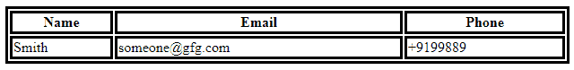

# HTML |表头属性

> 原文:[https://www.geeksforgeeks.org/html-headers-attribute/](https://www.geeksforgeeks.org/html-headers-attribute/)

**HTML 标题属性**指定了一个表格单元格所对应的一个或多个附加标题单元格。

**适用于:**

*   [**td 表头**](https://www.geeksforgeeks.org/html-td-headers-attribute/?ref=rp)
*   [**第**联箱](https://www.geeksforgeeks.org/html-th-headers-attribute/?ref=rp)

**属性值:**它包含值，即**标题 _id** ，指定表格标题单元格相关的一个或多个标题单元格的 id 分隔列表的空间。

**示例:**

## 超文本标记语言

```html
<!DOCTYPE html>
<html>

<head>
    <style>
        table,
        th,
        td {
            border: 3px solid black;
        }
    </style>
</head>

<body>

    <table style="width:100%">
        <tr>
            <th id="name">Name</th>
            <th id="email">Email</th>
            <th id="phone">Phone</th>

        </tr>
        <tr>
            <td headers="name">Smith</td>
            <td headers="email">someone@gfg.com</td>
            <td headers="phone">+9199889</td>

        </tr>
    </table>

</body>

</html>
```

**输出:**



**支持的浏览器:****HTML 表头属性**支持的浏览器如下:

*   谷歌 Chrome
*   歌剧
*   旅行队
*   火狐浏览器
*   微软公司出品的 web 浏览器