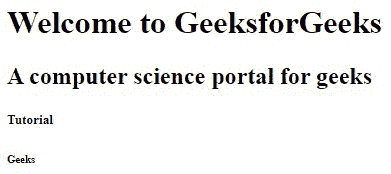

# HTML 标题

> 原文:[https://www.geeksforgeeks.org/html-heading/](https://www.geeksforgeeks.org/html-heading/)

**示例:**这个示例说明了 HTML 标题标签。

## 超文本标记语言

```html
<!DOCTYPE html>
<html>

<head>
    <title>Heading Tags</title>
</head>

<body>
    <h1>GeeksforGeeks</h1>
    <h2>GeeksforGeeks</h2>
    <h3>GeeksforGeeks</h3>
    <h4>GeeksforGeeks</h4>
    <h5>GeeksforGeeks</h5>
    <h6>GeeksforGeeks</h6> 
</body>

</html>
```

**输出:**


**标题标签:**HTML 标题标签用于定义页面的标题。HTML 定义了六个级别的标题。这六个标题元素是 H1、H2、H3、H4、H5 和 H6；H1 是最高级别，H6 是最低级别。

**航向的重要性:**

*   搜索引擎使用标题来索引网页的结构和内容。
*   标题用于突出重要的主题。
*   它们提供了有价值的信息，并告诉我们文档的结构。

**语法:**

```html
<h1></h1>
<h3></h3>
<h6></h6>
```

**示例:**

## 超文本标记语言

```html
<!DOCTYPE html>
<html>

<body>
    <h1>Welcome to GeeksforGeeks</h1>
    <h2>A computer science portal for geeks</h2>
    <h5>Tutorial</h5>
    <h6>Geeks</h6> 
</body>

</html>
```

**输出:**



**更改 HTML 标题的大小:**可以使用样式属性更改 HTML 标题的默认大小。

**示例:**

## 超文本标记语言

```html
<!DOCTYPE html>
<html>

<body>
    <!-- Style attribute is used here-->
    <h1 style="font-size: 50px">H1 with new size.</h1> 
</body>

</html>
```

**输出:**


**HTML 中的水平规则:**代表水平规则的< hr >标记用于定义 HTML 页面中的主题分隔符。<HR>标签为空标签，不需要结束标签。基本用于内容分离。详情请参考 [HTML < hr >标签](https://www.geeksforgeeks.org/html-hr-tag/)文章。

**示例:**

## 超文本标记语言

```html
<!DOCTYPE html>
<html>

<body>
    <h1>Heading 1</h1>
    <p>I like HTML.</p>

    <!-- hr Tag is used here-->
    <hr />
    <h2>Heading 2</h2>
    <p>I like CSS.</p>

    <!-- hr Tag is used here-->
    <hr />
    <h2>Heading 3</h2>
    <p>I like Javascript.</p>

</body>

</html>
```

**输出:**


**HTML 中的 head 元素:**HTML 中的< head >标签用于定义包含文档相关信息的文档头部。HTML 头部元素充当元数据的容器。元数据是关于未显示的 HTML 文档的数据。head 元素与标题无关。<头部>标签包含其他头部元素，如<标题>、<元>、<链接>、<样式>、<链接>等。头部元素放置在“HTML”标签和<主体>标签之间。详见 [HTML <标题>标签](https://www.geeksforgeeks.org/html-head-tag/)文章。

**示例:**

## 超文本标记语言

```html
<!DOCTYPE html>
<html>
<!-- head element starts here-->

<head>
    <title>Basics of HTML</title>
    <meta charset="UTF-8" /> 
</head>
<!-- head element ends here-->

<body>
    <p>I like HTML.</p>

    <p>HTML is easy to learn.</p>

</body>

</html>
```

**输出:**


**支持的浏览器:**

*   谷歌 Chrome 93.0
*   微软边缘 93.0
*   Internet Explorer 11.0
*   Firefox 92.0
*   Opera 78.0
*   Safari 14.1