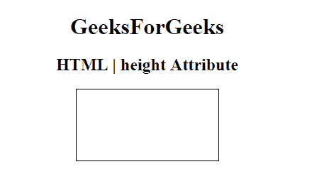

# HTML |身高属性

> 原文:[https://www.geeksforgeeks.org/html-height-attribute/](https://www.geeksforgeeks.org/html-height-attribute/)

**HTML |高度属性**用于*指定元素*的高度。它可用于以下元素:

*   [<画布>](https://www.geeksforgeeks.org/html-canvas-tag/)
*   [<嵌入>](https://www.geeksforgeeks.org/html-embed-tag/)
*   [< iframe >](https://www.geeksforgeeks.org/html-iframes/)
*   <【img】>
*   [<物体>](https://www.geeksforgeeks.org/html-object-tag/)
*   [<输入>](https://www.geeksforgeeks.org/html-input-tag/)

**示例:**本示例说明了 **<画布>** 元素中高度属性的使用。

## 超文本标记语言

```html
<!DOCTYPE html>
<html>

<head>
    <title>
      HTML | height Attribute
  </title>
</head>

<body style="text-align:center">
    <h1>GeeksForGeeks</h1>
    <h2>HTML | height Attribute</h2>
    <!-- canvas Tag starts here -->
    <canvas id="GeeksforGeeks"
            width="200"
            height="100"
            style="border:1px solid black">
    </canvas>
    <!-- canvas Tag ends here -->

</body>

</html>
```

**输出:**



**支持的浏览器:***HTML 高度属性*支持的浏览器如下:

*   谷歌 Chrome
*   微软公司出品的 web 浏览器
*   火狐浏览器
*   歌剧
*   旅行队