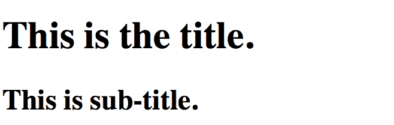
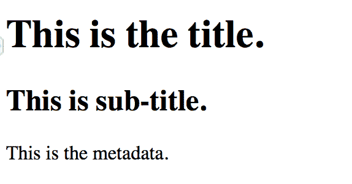

# HTML hgroup 标签

> 哎哎哎:# t0]https://www . geeksforgeeks . org/html-hgroup 标签/

HTML 中的

<hgroup>标记代表标题组，用于对标题元素进行分组。HTML 中的

<hgroup>标签用于包装一个或多个从

# 到

###### 的标题元素，如标题和子标题。

<hgroup>标签需要开始标签和结束标签。</hgroup>

</hgroup>

</hgroup>

**注意:**<group>已从 HTML5 规范中弃用。
**语法:**

```html
<hgroup> ... </hgroup>
```

以下示例说明了 HTML 中的

<hgroup>标记:
**示例 1:** 该示例包含标题和副标题。
</hgroup>

## 超文本标记语言

```html
<!DOCTYPE html>

<html>

    <body>
         <!--HTML hgroup tag starts here-->
            <hgroup>
                <h1>This is the title.</h1>
                <h2>This is sub-title.</h2>
            </hgroup>
         <!--HTML hgroup tag ends here-->
        </body>

</html>                   
```

**输出:**



**示例 2:** 该示例包含标题、子标题和元数据。

## 超文本标记语言

```html
<!DOCTYPE html>

<html>

    <body>
         <!--HTML hgroup tag starts here-->
         <hgroup>
            <h1>This is the title.</h1>
            <h2>This is sub-title.</h2>

<p>This is the metadata.</p>

        </hgroup>
        <!--HTML hgroup tag ends here-->
        </body>

</html>                   
```

**输出:**



**支持的浏览器:**

*   谷歌 Chrome 5.0
*   Internet Explorer 9.0
*   Firefox 4.0
*   歌剧 11.1
*   Safari 5.0