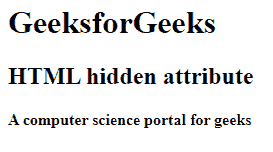
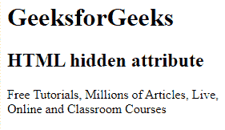

# HTML 隐藏属性

> 原文:[https://www.geeksforgeeks.org/html-hidden-attribute/](https://www.geeksforgeeks.org/html-hidden-attribute/)

**示例:**这个简单的示例通过在 HTML 中使用带有< div >元素的*隐藏*属性，向用户隐藏内容。

## 超文本标记语言

```html
<!DOCTYPE html>
<html>
<head>
    <title>hidden attribute</title>
</head>

<body>
    <h1>GeeksforGeeks</h1>
    <h2>HTML hidden attribute</h2>

    <!-- hidden paragraph -->
    <div hidden> 
This content will be hidden while displaying the content 
    </div>
    <h4>A computer science portal for geeks</h4> 
</body>
</html>
```

**输出:**



该属性用于定义元素的可见性。它包含一个布尔值。它是 HTML 代码中状态的语义指示器。如果使用此属性，浏览器将不会显示指定了隐藏属性的元素。隐藏的属性可以使用一些条件或用于查看隐藏内容的 JavaScript 来查看。为了保持对用户隐藏要呈现的内容或元素，直到满足某些其他条件，例如选择复选框等，使用该属性可能是有益的。

**语法:**

```html
<element hidden>
```

**注意:**这个属性在 HTML 5 中是新的。

**支持的标签:**这是一个[全局属性](https://www.geeksforgeeks.org/html-global-attributes/)，可以用在任何 HTML 元素上。

**示例 1:** 在本例中，我们使用了*隐藏*属性，该属性将在向浏览器呈现内容时隐藏内容。

## 超文本标记语言

```html
<!DOCTYPE html>
<html>
<head>
    <title>HTML hidden attribute</title>
</head>

<body>
    <h1>GeeksforGeeks</h1>
    <h2>HTML hidden attribute</h2>

    <!-- hidden paragraph -->
    <p hidden>
        We provide a variety of 
        services for you to learn, 
        thrive and also have fun! 
    </p>

<p>
       Free Tutorials, Millions of 
       Articles, Live, Online and 
       Classroom Courses
    </p>

</body>
</html>
```

**输出:**



**支持的浏览器:**

*   谷歌 Chrome 93.0 及以上
*   Internet Explorer 11.0
*   微软边缘 93.0
*   火狐 92.0 及以上版本
*   Opera 78.0
*   Safari 14.1