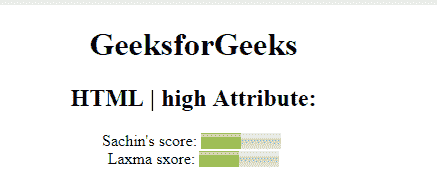

# HTML |高属性

> 原文:[https://www.geeksforgeeks.org/html-high-attribute/](https://www.geeksforgeeks.org/html-high-attribute/)

**HTML |高属性**用于*指定仪表值被认为是高值的范围*。
高属性值将小于最大属性值，但大于最小和低属性值。可与 **<米>** 元素配合使用。
**适用:**

*   **<计>**

**语法:**

```html
<meter high="number"> 
```

**属性值:**包含被认为是高值的浮点数。

**示例:**本示例说明了高属性在米元素中的使用。

## 超文本标记语言

```html
<!DOCTYPE html>
<html>

<head>
    <title>
      HTML | high attribute
  </title>
</head>

<body style="text-align:center;">
    <h1>GeeksforGeeks</h1>
    <h2>
      HTML | high Attribute:
  </h2> Sachin's score:
    <meter value="5"
           min="0"
           max="10"
           high="6">
      5 out of 10
  </meter>
    <br>Laxma sxore:
    <meter value="0.5"
           max="1.0"
           min="0"
           high="0.6">
      50% from 100%
  </meter>
</body>

</html>
```

**输出:**



**支持的浏览器:***HTML 高属性*支持的浏览器如下:

*   谷歌 Chrome
*   微软公司出品的 web 浏览器
*   火狐浏览器
*   歌剧
*   旅行队