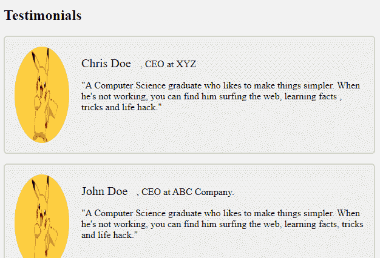

# HTML |如何添加奖状？

> 原文:[https://www.geeksforgeeks.org/html-how-to-add-testimonials/](https://www.geeksforgeeks.org/html-how-to-add-testimonials/)

**推荐语**是用户的书面推荐，通常出现在网页的单独部分。在这篇文章中，我们将学习如何在我们的网页上添加好看的有响应的评价。

通常，证明包含用户的姓名、图片、他/她的身份(可选)以及最重要的他/她的引用文本。

**添加 HTML:**
我们将添加用户的姓名、个人资料图片、他/她的身份以及他/她的大部分引用文本

```html
<div class="container">
    "
    <p><span>Chris Doe</span>, CEO at XYZ.</p>
    <p>"A Computer Science graduate who likes to make things simpler.
       When he's not working, you can find him surfing the web,
       learning facts, tricks and life hacks. He also enjoys
       movies in his leisure time."</p>
</div>

<div class="container">
    
    <p><span>John Doe</span> CEO at ABC Company.</p>
    <p>"A Computer Science graduate who likes to make things simpler.
        When he's not working, you can find him surfing the web,
        learning facts, tricks and life hack.
        He also enjoys movies in his leisure time."</p>
</div>
```

**添加 CSS:**

```html
.container {
  border: 2px solid #ccc;
  background-color: #eee;
  border-radius: 5px;
  padding: 16px;
  margin: 16px 0;
}

.container img {
  float: left;
  margin-right: 20px;
  border-radius: 50%;
}

/* Adding media queries for responsiveness.
@media (max-width: 500px) {
  .container {
    text-align: center;
  }

  .container img {
    margin: auto;
    float: none;
    display: block;
  }
}
```

**示例:**

```html
<!DOCTYPE html>
<html>

<head>
    <meta name="viewport"
          content="width=device-width, 
                   initial-scale=1">
    <style>
        .container {
            border: 2px solid #ccc;
            background-color: #eee;
            border-radius: 5px;
            padding: 16px;
            margin: 16px 0
        }

        .container::after {
            content: "";
            clear: both;
            display: table;
        }

        .container img {
            float: left;
            margin-right: 20px;
            border-radius: 50%;
        }

        .container span {
            font-size: 20px;
            margin-right: 15px;
        }

        @media (max-width: 500px) {
            .container {
                text-align: center;
            }
            .container img {
                margin: auto;
                float: none;
                display: block;
            }
        }
    </style>
</head>

<body>

    <h2>Testimonials</h2>

    <div class="container">
        
        <p><span>Chris Doe</span>, CEO at XYZ</p>
        <p>"A Computer Science graduate who likes to make things simpler.
          When he's not working, you can find him surfing the web, learning facts
          , tricks and life hack."</p>
    </div>

    <div class="container">
        
        <p><span>John Doe</span>, CEO at ABC Company.</p>
        <p>"A Computer Science graduate who likes to make things simpler.
          When he's not working, you can find him surfing the web,
         learning facts, tricks and life hack."</p>
    </div>

</body>

</html>
```

**输出:**
