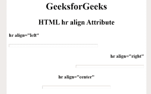

# HTML |

* * *

对齐属性

> 原文:[https://www.geeksforgeeks.org/html-hr-align-attribute/](https://www.geeksforgeeks.org/html-hr-align-attribute/)

**HTML < hr >对齐属性**用于*指定水平线*的对齐。如果宽度属性未设置为 100%，则对齐属性不会产生任何效果。
**语法:**

```html
<hr align="left | center | right">
```

**属性值:**

*   **左:**设置左对齐水平线。
*   **中心:**设置中心对齐水平线。这是默认值。
*   **右:**设置右对齐水平线。

**注意:**HTML 5 不支持< hr >对齐属性。
**例:**

## 超文本标记语言

```html
<!DOCTYPE html>
<html>

<head>
    <style>
        h1,h2
        {
            text-align:center;
        }
        h4
        {
            font-weight:bold;
        }
        .gfg
        {
           text-align:right;
            font-weiht:bold;
        }
        .gfg2
        {
            font-weight:bold;
            text-align:center;
        }
    </style>
</head>

<body>

    <h1>GeeksforGeeks</h1>
    <h2>
        HTML hr align Attribute

    </h2>
    <h4>
        hr align="left"
    </h4>
    <hr width="300px;"
        size="10"
        align="left">
    <h4 class="gfg">
        hr align="right"
    </h4>
    <hr width="50%" align="right"
        size="10">
        <h4 class="gfg2">
           hr align="center"       
        </h4>

    <hr width="50%"
        size="10"
        align="center">
</body>

</html>
```

**输出:**



**支持的浏览器:**T2 HTML<HR>对齐属性支持的浏览器如下:

*   谷歌 Chrome
*   微软公司出品的 web 浏览器
*   火狐浏览器
*   旅行队
*   歌剧