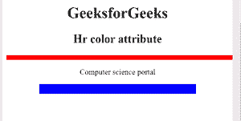

# HTML

* * *

颜色属性

> 原文:[https://www.geeksforgeeks.org/html-hr-color-attribute/](https://www.geeksforgeeks.org/html-hr-color-attribute/)

**HTML < hr >颜色属性**用于指定水平规则的颜色。HTML 5 不支持。
**语法:**

```html
<Hr color= "color_name | hex_number | rgb_number"> 
```

**属性值:**

*   **颜色名称:**使用颜色名称设置文本颜色。比如“红色”。
*   **十六进制数:**使用颜色十六进制码设置文本颜色。例如“#0000ff”。
*   **rgb_number:** 使用 rgb 代码设置文本颜色。例如:“RGB(0，153，0)”。

**例:**

## 超文本标记语言

```html
<!DOCTYPE html>
<html>

<head>
    <title>
        HTML hr color Attribute
    </title>
</head>

<body style="text-align:center;">
    <h1>GeeksforGeeks</h1>
    <h2> Hr color  attribute</h2>
    <hr width="500px;" color="red"
        size="10">

<p>Computer science portal</p>

    <hr width="70%"
        size="20" color="blue"
        noshade>
</body>

</html>
```

**输出**

