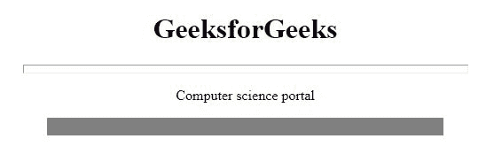

# HTML |

* * *

noshade 属性

> 原文:[https://www.geeksforgeeks.org/html-hr-noshade-attribute/](https://www.geeksforgeeks.org/html-hr-noshade-attribute/)

**HTML < hr > noshade 属性**是布尔值，用于*指定水平实线而不是阴影线*。

**语法:**

```html
<hr noshade>
```

**注意:**HTML 5 不支持< hr > noshade 属性。

**示例:**

```html
<!DOCTYPE html>
<html>

<head>
    <title>
        HTML hr noshade Attribute
    </title>
</head>

<body style="text-align:center;">
    <h1>GeeksforGeeks</h1>
    <hr width="500px;"
        size="10">
    <p>Computer science portal</p>
    <hr width="70%" 
        size="20" 
        noshade>
</body>

</html>
```

**输出:**


**支持的浏览器:**以下列出了 **HTML < hr > noshade 属性**支持的浏览器:

*   谷歌 Chrome
*   微软公司出品的 web 浏览器
*   火狐浏览器
*   旅行队
*   歌剧