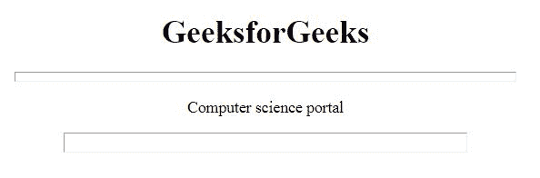

# HTML |

* * *

大小属性

> 原文:[https://www.geeksforgeeks.org/html-hr-size-attribute/](https://www.geeksforgeeks.org/html-hr-size-attribute/)

**HTML < hr >大小属性**用于*以像素*为单位指定水平线的高度。

**语法:**

```html
<hr size="pixels">
```

**属性值:**包含单值**像素**，以像素为单位指定高度。

**注意:**HTML 5 不支持< hr >大小属性。

**示例:**

```html
<!DOCTYPE html>
<html>

<head>
    <title>
        HTML hr size Attribute
    </title>
</head>

<body style="text-align:center;">
    <h1>GeeksforGeeks</h1>
    <hr width="500px;" 
        size="10">
    <p>Computer science portal</p>
    <hr width="70%" 
        size="20">
</body>

</html>
```

**输出:**


**支持的浏览器:**支持的浏览器 **HTML < hr >大小属性**如下:

*   谷歌 Chrome
*   微软公司出品的 web 浏览器
*   火狐浏览器
*   旅行队
*   歌剧