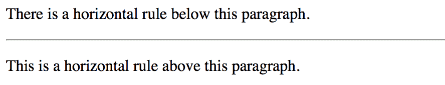
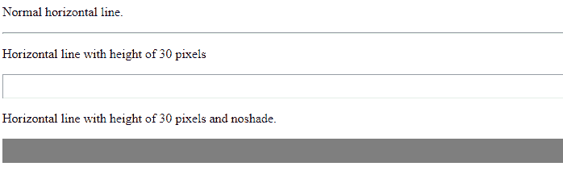

# HTML

* * *

标签

> 哎哎哎:# t0]https://www . geeksforgeeks . org/html-HR-tag/

HTML 中的

* * *

标记代表水平规则，用于在 HTML 页面中插入水平规则或主题分隔符，以划分或分隔文档部分。

* * *

标签为空标签，不需要结束标签。
**标签属性:**下面给出的表格描述了< hr >标签属性:

<figure class="table">

| attribute | value | explain |
| [Alignment](https://www.geeksforgeeks.org/html-hr-align-attribute/) | Zuoyou | Used to specify the alignment of horizontal lines. |
| [无阴影](https://www.geeksforgeeks.org/html-hr-noshade-attribute/) | 没有阴影 | Used to specify bars without shading effect. |
| [dimension](https://www.geeksforgeeks.org/html-hr-size-attribute/) | pixel | Used to specify the height of the horizontal line. |
| [Width](https://www.geeksforgeeks.org/html-hr-width-attribute/) | pixel | Used to specify the width of the horizontal line. |

</figure>

**语法:**

```html
<hr> ...
```

下面的程序说明了 HTML 中的

* * *

标记:
**示例 1:**

## 超文本标记语言

```html
<!DOCTYPE html>

<html>

    <body>

<p>There is a horizontal rule below this paragraph.</p>

        <!--HTML hr tag is used here-->
        <hr>

<p>This is a horizontal rule above this paragraph.</p>

    </body>       

</html>                    
```

**输出:**



**示例 2(带属性的 hr 标签):**

## 超文本标记语言

```html
<!DOCTYPE html>

<html>

    <body>

<p>Normal horizontal line.</p>

        <!--HTML hr tag is used here-->
        <hr>

<p>Horizontal line with height of 30 pixels</p>

        <hr size="30">

<p>Horizontal line with height of 30 pixels
                                       and noshade.</p>

        <hr size="30" noshade> 

    </body>

</html>                    
```

**输出:**



**支持的浏览器:**

*   谷歌 Chrome
*   微软公司出品的 web 浏览器
*   火狐浏览器
*   歌剧
*   旅行队

HTML 是网页的基础，通过构建网站和网络应用程序用于网页开发。您可以通过以下 [HTML 教程](https://www.geeksforgeeks.org/html-tutorials/)和 [HTML 示例](https://www.geeksforgeeks.org/html-examples/)从头开始学习 HTML。

CSS 是网页的基础，通过设计网站和网络应用程序用于网页开发。你可以通过以下 [CSS 教程](https://www.geeksforgeeks.org/css-tutorials/)和 [CSS 示例](https://www.geeksforgeeks.org/css-examples/)从头开始学习 CSS。