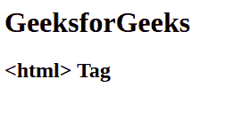

# HTML 标签

> 原文:[https://www.geeksforgeeks.org/html-html-tag/](https://www.geeksforgeeks.org/html-html-tag/)

HTML 中的标记用于定义 HTML 和 XHTML 文档的根。标签告诉浏览器它是一个 HTML 文档。它是 HTML 文档中出现的所有内容的第二个外部容器，后面跟着标签。标签需要一个开始和结束标签。
**语法:**

```html
<html> HTML Contents... </html>
```

**属性值:**<html>标签包含单属性 [*xmlns*](https://www.geeksforgeeks.org/html-html-xmlns-attribute/) ，其属性值为*http://www.w3.org/1999/xhtml*。它用于定义命名空间属性。
以下示例说明了 html 中的< html >元素:
**示例 1:**

## 超文本标记语言

```html
<!DOCTYPE html>
<!-- html tag starts here -->
<html>

        <body>

            <h1>GeeksforGeeks</h1>
            <h2><html> Tag</h2>

        </body>

</html>                   
<!-- html tag ends here -->
```

**输出:**



**示例 2:** 在< html >标签中使用 xmlns 属性。

## 超文本标记语言

```html
<!DOCTYPE html PUBLIC "-//W3C//DTD XHTML 1.0 Transitional//EN"
"http://www.w3.org/TR/xhtml1/DTD/xhtml1-transitional.dtd">
<html xmlns="http://www.w3.org/1999/xhtml">
    <head>
        <title>html Tag</title>
        <style>
            h1 {
                color:green;
            }
            body {
                text-align:center;
            }
        </style>
    </head>
    <body>
        <h1>GeeksforGeeks</h1>
        <h2><html> Tag</h2>
    </body>
</html>                   
```

**输出:**


**支持的浏览器:**

*   谷歌 Chrome
*   微软公司出品的 web 浏览器
*   火狐浏览器
*   歌剧
*   旅行队