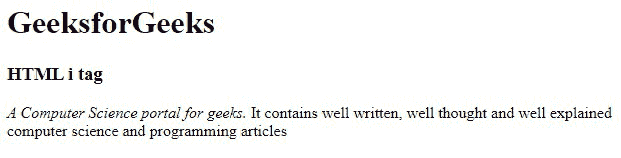
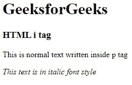
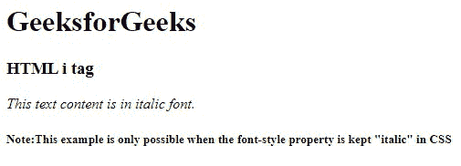

# HTML i 标签

> 原文:[https://www.geeksforgeeks.org/html-i-tag/](https://www.geeksforgeeks.org/html-i-tag/)

**示例:**这是一个简单的示例，说明了使用< i >标签将 HTML 中的文本变成斜体。

## 超文本标记语言

```html
<!DOCTYPE html>
<html>
<head>
    <title>HTML i Tag</title>
</head>

<body>
    <h1>GeeksforGeeks</h1>
    <h3>HTML i tag</h3>
    <div>
        <p>
          <i>A Computer Science portal for geeks.</i> 
          It contains well written, well thought and well 
          explained computer science and programming articles 
        </p>

    </div>
</body>
</html>
```

**输出:**



HTML 中的*标签用于以斜体显示内容。该标签通常用于显示技术术语、短语、不同语言中的重要单词。*标签是包含开始标签、内容和结束标签的容器标签。**

**语法:**

```html
<i> Contents... </i>
```

**接受属性** **:** 这是一个 [全局属性](https://www.geeksforgeeks.org/html-global-attributes/) ，可以用在任何 HTML 元素上。

下面的代码示例说明了*标签在 HTML 中的使用。*

**示例 1:** 在本例中，我们使用了< i >标记& < p >标记来说明渲染时文本外观的差异。

## 超文本标记语言

```html
<!DOCTYPE html>
<html>
<head>
    <title>HTML Italic Tag</title>
</head>

<body>
    <h1>GeeksforGeeks</h1>
    <h3>HTML i tag</h3>
    <p>This is normal text written inside p tag</p>

    <!--HTML <i>(italic) tag is used here-->
    <i>This text is in italic font style</i> 
</body>
</html>
```

**输出:**



**例 2:** 一个文本也可以用 CSS 写成斜体。当 [CSS 字体属性](https://www.geeksforgeeks.org/css-font-style-property/)设置为斜体时，可以看到如下文本:

## 超文本标记语言

```html
<!DOCTYPE html>
<html>
<head>
    <title>HTML Italic Tag</title>
</head>

<body>
    <h1>GeeksforGeeks</h1>
    <h3>HTML i tag</h3>

    <!--Example for font-style: italic -->
    <p style="font-style: italic;"> 
        This text content is in italic font.
    </p>

    <h5>Note:This example is only possible when the
        font-style property is kept "italic" in CSS
    </h5> 
</body>
</html>
```

**输出:**



用法:

*   出于可读性的目的，使用*标记表示您希望以不同于普通短语的方式显示的单词*
*   像*和**这样的标签现在定义了语义，而不是印刷外观。因此，要以斜体显示文本，用户可以使用 CSS 字体样式属性。***
*   仅当未标记以下元素时，才使用*标记:*
    *   [<在>](https://www.geeksforgeeks.org/html-em-tag/) 中
    *   [<强>](https://www.geeksforgeeks.org/html-strong-tag/)
    *   [<标记>](https://www.geeksforgeeks.org/html5-mark-tag/)
    *   [<引用>](https://www.geeksforgeeks.org/html-cite-tag/)
    *   [<【dfn】>](https://www.geeksforgeeks.org/html-dfn-tag/)

**支持的浏览器:**

*   谷歌 Chrome 93.0
*   Internet Explorer 11.0
*   微软边缘 93.0
*   Firefox 92.0
*   Opera 78.0
*   Safari 14.1