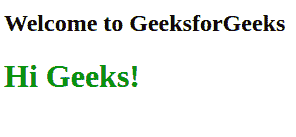
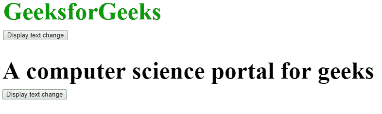

# HTML Id 属性

> 原文:[https://www.geeksforgeeks.org/html-id-attributes/](https://www.geeksforgeeks.org/html-id-attributes/)

**示例:**在这个示例中，我们简单地用 id“geeks”对元素进行样式化。

## 超文本标记语言

```html
<!DOCTYPE html>
<html>

<head>
    <style>
        #geeks {
            color: green;
        }
    </style>
</head>

<body>

    <h2>Welcome to GeeksforGeeks</h2>

    <h1 id="geeks">Hi Geeks!</h1>

</body>

</html>
```

**输出:**



id 属性是用于指定文档的唯一标识符。它被 CSS 和 JavaScript 用来为一个独特的元素执行特定的任务。在 CSS 中，id 属性使用#符号后跟 id 来使用。在所有情况下，在 tag= "中引号都不是强制性的。但是用引号写作是一个很好的做法。

**语法:**

```html
 <tag id=""></tag>
```

**注意:**这是一个全局属性，它可以用在所有的标签中。

**示例:**

## 超文本标记语言

```html
<!DOCTYPE html>
<html>

<head>
    <title>Id Attributes</title>
    <style>
        #gfg {
            color: #009900;
            font-size: 50px;
            font-weight: bold;
            text-align: center;
        }

        #geeks {
            text-align: center;
            font-size: 20px;
        }
    </style>
</head>

<body>
    <div id="gfg">GeeksforGeeks</div>
    <div id="geeks">A computer science portal for geeks</div>
</body>

</html>
```

**输出:**


**注意:**在 HTML5 中，id 属性可以被任何 HTML 标签使用，但是在 HTML 4.01 中使用 id 属性有一些限制。不能被<底座>、<头部>、< html >、< meta >、< param >、<脚本>、<样式>、<标题>标签使用。在 HTML4.01 中，id 不能以数字开头。

**在 JavaScript 中 id 属性的使用:**在 JavaScript 中，id 属性是用来操纵文本的，如果想要对脚本中的精确元素进行更改，那么可以使用 ID 属性。

**示例:**

## 超文本标记语言

```html
<!DOCTYPE html>
<html>

<head>
    <title>use id in javascript</title>
    <style>
        #geeks {
            font-size: 50px;
            color: #009900;
            font-weight: bold;
            margin-bottom: 10px;
        }
    </style>
</head>

<body>
    <div id="geeks">GeeksforGeeks</div>
    <button onclick="geeksResult()">Display text change</button>

    <script>
        function geeksResult() {
            document.getElementById("geeks").innerHTML =
                "A computer science portal for geeks";
            document.getElementById("geeks").style.color = "black";
        }
    </script>

</body>

</html>
```

**输出:**



**支持的浏览器:**

*   谷歌 Chrome
*   边缘 12 及以上
*   Firefox 32 及以上版本
*   微软公司出品的 web 浏览器
*   浏览器名
*   歌剧
*   旅行队