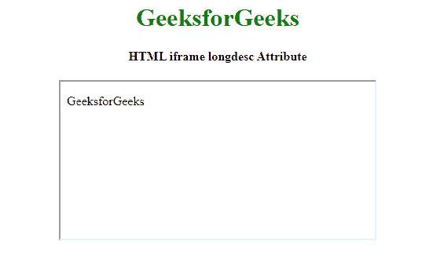

# HTML | iframe longdesc 属性T3】

> 原文:[https://www . geesforgeks . org/html-iframe-long desc-attribute/](https://www.geeksforgeeks.org/html-iframe-longdesc-attribute/)

**HTML < iframe > longdesc 属性**用于指定包含 iframe 元素内容的长描述的页面。

**语法:**

```html
<Iframe longdesc="URL"> 
```

**属性值:**

*   **URL:** 包含单个值，即 **URL** ，指定包含框架内容长描述的页面。
    1.  **绝对 URL:** 指向另一个网站。
    2.  **一个相对 URL:** 它指向网站内的一个文件。

**示例:**

```html
<!DOCTYPE html>
<html>

<head>
    <title>
        HTML iframe longdesc Attribute
    </title>
</head>

<body style="text-align:center;">

    <h1 style="color:green;">GeeksforGeeks</h1>

    <h4>HTML iframe longdesc Attribute</h4>

    <iframe src="https://ide.geeksforgeeks.org/index.php" 
            srcdoc="<p>GeeksforGeeks</p>" id="GFG" 
            longdesc="gfg.txt" height="200" width="400" 
            name="myGeeks">
    </iframe>

</body>

</html>
```

**输出:**


**支持的浏览器:**主要浏览器不支持 **HTML < iframe > longdesc 属性**。