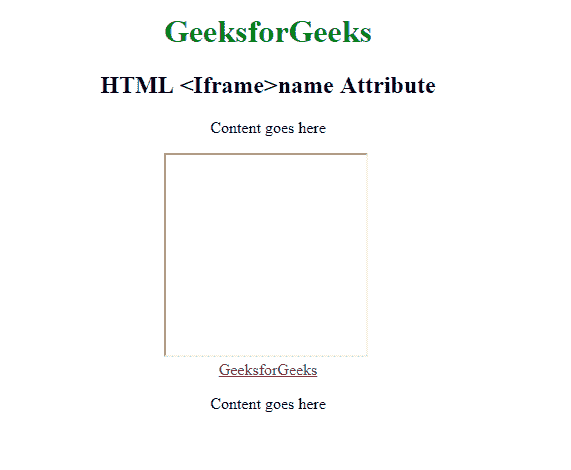

# HTML | iframe 名称属性

> 原文:[https://www.geeksforgeeks.org/html-iframe-name-attribute/](https://www.geeksforgeeks.org/html-iframe-name-attribute/)

**HTML iframe 名称属性**用于为 **< Iframe >** 元素指定引用。name 属性也用作对 Javascript 中元素的引用。

**语法:**

```html
<iframe name="name">
```

**属性值:**

*   **名称:**它指定 Iframe 元素的名称。

**示例:**

```html
<!DOCTYPE html>
<html>

<head>
    <style>
        body {
            text-align: center;
        }
    </style>
</head>

<body>
    <h1 style="color:green">
      GeeksforGeeks
  </h1>
    <h2>
      HTML <Iframe>name Attribute
  </h2>
    <p>Content goes here</p>

    <iframe src="" 
            height="200" 
            width="200" 
            name="myGeeks">
    </iframe>
    <br>
    <a href="https://ide.geeksforgeeks.org/" 
       target="myGeeks">
      GeeksforGeeks
  </a>

    <p>Content goes here</p>

</body>

</html>
```

**输出:**
**前:**

**后:**


**支持的浏览器:**支持的浏览器 **HTML < iframe >名称属性**如下:

*   谷歌 Chrome
*   微软公司出品的 web 浏览器
*   火狐浏览器
*   苹果 Safari
*   歌剧