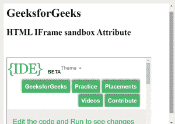

# HTML | iframe 沙盒属性

> 原文:[https://www . geesforgeks . org/html-iframe-sandbox-attribute/](https://www.geeksforgeeks.org/html-iframe-sandbox-attribute/)

**沙盒属性**允许对 iframe 中的内容进行一组额外的限制。
沙盒属性存在时，会:

*   将内容视为来自单一来源
*   它阻止表单提交
*   它会阻止脚本执行
*   它禁用了 API
*   它还防止链接瞄准其他浏览上下文
*   它停止内容以导航其顶级浏览上下文
*   阻止自动触发的功能(例如自动播放视频或自动聚焦表单控件)

沙盒属性的值要么是简单的沙盒(然后应用所有限制)，要么是一个用空格分隔的预定义值列表，它将带走实际的限制。

**语法:**

```html
<iframe sandbox="value">
```

**属性值**

*   **无值:**适用所有限制
*   **允许表单:**重新启用表单提交
*   **允许指针锁定:**重新启用应用编程接口
*   **允许弹出窗口:**重新启用弹出窗口
*   **允许相同来源:**允许将 iframe 的内容视为来自相同来源
*   **允许-脚本:**重新启用脚本
*   **允许顶级导航:**允许 iframe 的内容导航其顶级浏览上下文

**例:**

## 超文本标记语言

```html
<!DOCTYPE html>
<html>

<head>
    <title>
        HTML Iframe sandbox Attribute
    </title>
</head>

<body>
    <h1>GeeksforGeeks</h1>

    <h2>HTML IFrame sandbox Attribute</h2>

    <br>
    <br>

    <iframe id="GFGFrame"
            src="https://ide.geeksforgeeks.org/tryit.php"
            width="400"
            height="200"
            sandbox>
    </iframe>
</body>

</html>
```

**输出:**



**支持的浏览器:**HTML IFrame 沙盒属性支持的浏览器如下

*   谷歌 Chrome 4.0
*   Firefox 4.0
*   苹果 Safari 4.0
*   歌剧 10.5
*   边缘