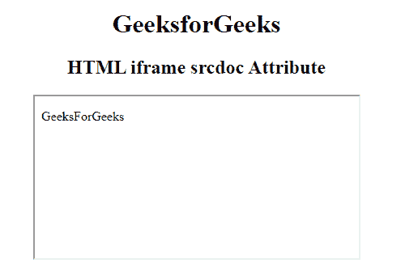

# HTML | iframe srcdoc 属性

> 原文:[https://www.geeksforgeeks.org/html-iframe-srcdoc-attribute/](https://www.geeksforgeeks.org/html-iframe-srcdoc-attribute/)

**HTML < iframe > srcdoc 属性**用于指定元素中文档的 HTML 内容。它可以与沙箱和无缝属性一起使用。

**语法:**

```html
<iframe srcdoc="HTML_code">
```

**属性值**

*   **HTML_code:** 用于指定将在一个 Iframe 元素中显示的页面的 HTML 内容。

**示例:**

```html
<!DOCTYPE html> 
<html> 

<head> 
    <title> 
        HTML iframe srcdoc Attribute 
    </title> 
</head> 

<body style="text-align:center;"> 

    <h1>GeeksforGeeks</h1> 

    <h2>HTML iframe srcdoc Attribute</h2> 

    <iframe src="https://ide.geeksforgeeks.org/index.php"
            srcdoc="<p>GeeksForGeeks</p>" id="GFG" 
            height="200" width="400" name="myGeeks"> 
    </iframe> 

</body> 

</html> 
```

**输出:**


**支持的浏览器:**以下列出了**HTML<iframe>>srcdoc 属性**支持的浏览器:

*   谷歌 Chrome
*   火狐浏览器
*   苹果 Safari
*   歌剧