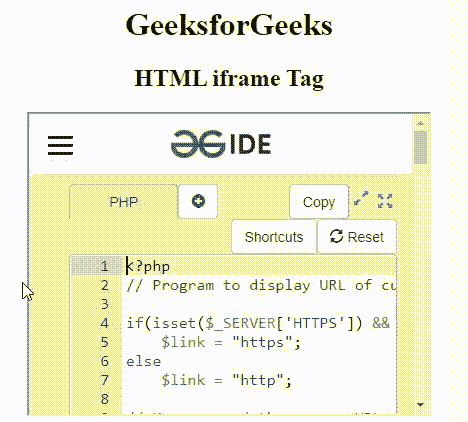
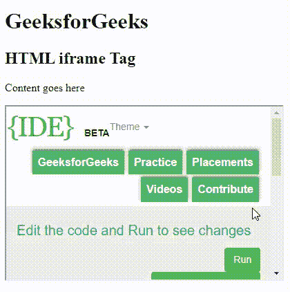
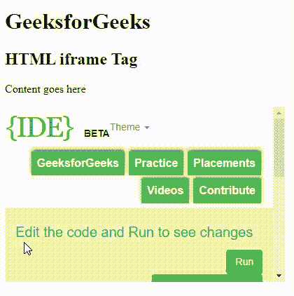
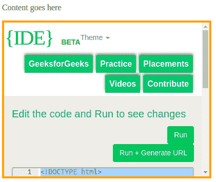
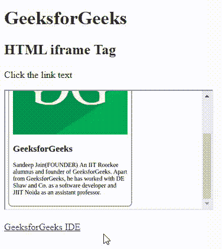

# HTML Iframes

> 哎哎哎:# t0]https://www . geeksforgeeks . org/html-iframe/

在本文中，我们将通过示例了解 **HTML Iframes** ，它们的实现。HTML 中的 iframe 代表**内嵌框架**。“iframe”标签在文档中定义了一个矩形区域，浏览器可以在其中显示单独的文档，包括滚动条和边框。内联框架用于在当前的 HTML 文档中嵌入另一个文档。HTML iframe name 属性用于指定对< Iframe >元素的引用。name 属性还被用作 JavaScript 中元素的引用。iframe 主要用于显示当前网页中的网页。“ **src** 属性用于指定占据 iframe 的文档的 URL。

**语法:**

```html
<iframe src="URL" title="description"></iframe>
```

**属性值:**它包含一个单值网址，指定嵌入 iframe 的文档的网址。下面列出了两种类型的网址链接:

*   **绝对 URL:** 指向另一个网页。
*   **相对 URL:** 指向同一网页的其他文件。

**示例:**该示例说明了 iframe 标记的使用，该标记用于在当前网页内显示网页。

## 超文本标记语言

```html
<!DOCTYPE html>
<html>

<head>
    <title>HTML iframe Tag</title>
</head>

<body style="text-align: center">
    <h1>GeeksforGeeks</h1>
    <h2>HTML iframe Tag</h2>
    <iframe src=
"https://ide.geeksforgeeks.org/index.php" 
            height="200" 
            width="400">

    </iframe>
</body>

</html>
```

**输出:**



HTML iframe 标记

**接受属性:**以下属性可以与 HTML 中的< iframe >标签一起使用。

*   **HTML < iframe >允许属性**
*   **HTML<iframe>allow full screen 属性**
*   **HTML<iframe>allowpaymentrequest 属性**
*   [**HTML < iframe >身高属性**T3】](https://www.geeksforgeeks.org/html-iframe-height-attribute/)
*   [**HTML < iframe >宽度属性**T3】](https://www.geeksforgeeks.org/html-iframe-width-attribute/)
*   **HTML < iframe >加载属性**
*   [**HTML < iframe >滚动属性**](https://www.geeksforgeeks.org/html-iframe-scrolling-attribute/)
*   [**HTML < iframe >名称属性**T3】](https://www.geeksforgeeks.org/html-iframe-name-attribute/)
*   [**HTML<iframe>referrer policy 属性**](https://www.geeksforgeeks.org/html-iframe-referrerpolicy-attribute/)
*   [**HTML < iframe >沙盒属性**T3】](https://www.geeksforgeeks.org/html-iframe-sandbox-attribute/)
*   [**HTML < iframe > src 属性**T3】](https://www.geeksforgeeks.org/html-iframe-src-attribute/)
*   [**HTML<iframe>srcdoc 属性**T3】](https://www.geeksforgeeks.org/html-iframe-srcdoc-attribute/)

**下面给出了几个属性示例:**

**高度和宽度:**高度和宽度属性用于指定 iframe 的大小。默认情况下，属性值以像素为单位指定，但也可以以百分比(如“80%”)指定。

**示例:**本示例通过设置 iframe 的宽度&高度来描述 HTML iframe 标签。

## 超文本标记语言

```html
<!DOCTYPE html>
<html>

<body>
    <h1>GeeksforGeeks</h1>
    <h2>HTML iframe Tag</h2>
    <p>Content goes here</p>

    <iframe src=
"https://ide.geeksforgeeks.org/tryit.php" 
            height="300" 
            width="400"> 
    </iframe>
</body>

</html>
```

**输出:**



设置 HTML iframe 的宽度和高度

**移除边框:**默认情况下，iframe 周围有边框。要移除边框，我们必须使用样式属性和 CSS 边框属性。

**示例:**此示例描述了 HTML iframe 标记，其中边框属性设置为*无*。

## 超文本标记语言

```html
<!DOCTYPE html>
<html>

<body>
    <h1>GeeksforGeeks</h1>
    <h2>HTML iframe Tag</h2>
    <p>Content goes here</p>

    <iframe src=
"https://ide.geeksforgeeks.org/tryit.php" 
            height="300" 
            width="400" 
            style="border: none"> 
    </iframe>
</body>

</html>
```

**输出:**



没有边框的 HTML iframe

**边框样式:**更改 Iframe 边框的大小、样式和颜色:

**示例:**本示例通过指定边框样式来描述 HTML iframe Tag。

## 超文本标记语言

```html
<!DOCTYPE html>
<html>

<body>
    <p>Content goes here</p>
    <iframe src=
"https://ide.geeksforgeeks.org/tryit.php" 
            height="300" 
            width="400" 
            style="border: 4px solid orange"> 
    </iframe>
</body>

</html>
```

**输出:**



带边框样式的 HTML iframe

**链接:**iframe 可以用作链接的目标帧。链接的目标属性必须引用 iframe 的名称属性。

**示例:**本示例通过使用链接的目标框架来描述 HTML iframe 标记。

## 超文本标记语言

```html
<!DOCTYPE html>
<html>

<body>
    <h1>GeeksforGeeks</h1>
    <h2>HTML iframe Tag</h2>
    <p>Click the link text</p>
    <iframe height="300" 
            width="350" 
            src=
"https://media.geeksforgeeks.org/wp-content/uploads/20210910170539/gfg-221x300.png"
            name="iframe_a"> 
    </iframe>
    <p><a href=
"https://ide.geeksforgeeks.org/tryit.php" 
           target="iframe_a">
        GeeksforGeeks IDE
        </a> 
    </p>

</body>

</html>
```

**输出:**



带有链接标签的 HTML iframe

**支持的浏览器:**

*   谷歌 Chrome 93.0
*   Internet Explorer 11.0
*   Firefox 92.0
*   微软边缘 93.0
*   Opera 78.0
*   Safari 14.1