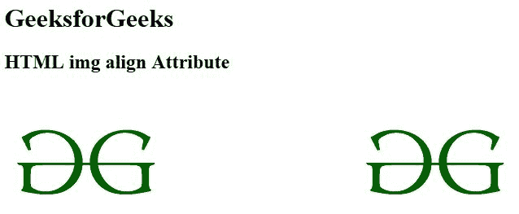

# HTML | 对齐属性

> 原文:[https://www.geeksforgeeks.org/html-img-align-attribute/](https://www.geeksforgeeks.org/html-img-align-attribute/)

**< img >对齐属性**用于*设置图像的对齐方式*。它是一个内联元素。它用于根据周围元素指定图像的对齐方式。
HTML 5 不支持。HTML 5 使用 CSS 属性而不是这个属性。

**语法:**

```html

```

**属性值:**

*   **左:**设置图像向左对齐。
*   **右:**设置图像向右对齐。
*   **中间:**设置图像向中间对齐。
*   **顶部:**设置图像与顶部对齐。
*   **底部:**设置图像向底部对齐。

**示例:**

```html
<!DOCTYPE html>
<html>

<head>
    <title>
        HTML img alt Attribute
    </title>
</head>

<body>
    <h1>GeeksforGeeks</h1>

    <h2>HTML img align Attribute</h2>

    
    
</body>

</html>
```

**输出:**


**支持的浏览器:**以下是 **HTML < img >对齐属性**支持的浏览器:

*   谷歌 Chrome
*   微软公司出品的 web 浏览器
*   火狐浏览器
*   旅行队
*   歌剧

HTML 是网页的基础，通过构建网站和网络应用程序用于网页开发。您可以通过以下 [HTML 教程](https://www.geeksforgeeks.org/html-tutorials/)和 [HTML 示例](https://www.geeksforgeeks.org/html-examples/)从头开始学习 HTML。