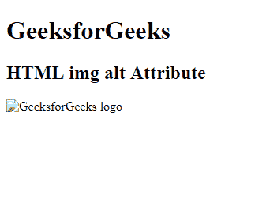

# HTML |  alt 属性

> 原文:[https://www.geeksforgeeks.org/html-img-alt-attribute/](https://www.geeksforgeeks.org/html-img-alt-attribute/)

**< img > alt 属性**用于指定图像的替代文本。当图像不显示时，它很有用。它用于为图像提供替代信息。

**语法:**

```html

```

**属性值:**它包含单值文本，指定图像的替代文本。

**示例:**

```html
<!DOCTYPE html>
<html>

<head>
    <title>
        HTML img alt Attribute
    </title>
</head>

<body>
    <h1>GeeksforGeeks</h1>

    <h2>HTML img alt Attribute</h2>

    

</body>

</html>
```

**输出:**


**支持的浏览器:**以下是 *HTML < img > alt 属性*支持的浏览器:

*   谷歌 Chrome
*   微软公司出品的 web 浏览器
*   火狐浏览器
*   旅行队
*   歌剧