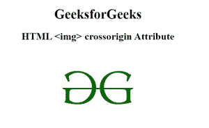

# HTML 跨原点属性

> 原文:[https://www . geesforgeks . org/html-img-cross origin-attribute/](https://www.geeksforgeeks.org/html-img-crossorigin-attribute/)

当我们试图取出时，中的 **HTML 交叉源属性用于支持 CORS **请求的< img >元素。png 或。来自第三方服务器或其他域的 jpg 文件。****

**语法**

```html

```

**属性值:**

*   **匿名**:有默认值。它定义了在不传递凭据信息的情况下发送 CORS 请求。
*   **使用-凭证:**跨来源请求将与凭证、cookies 和证书一起发送。

**示例:**下面的代码说明了<视频>元素中交叉原点属性的使用。它被设置为“匿名”值，该值检索。png 或。不传递凭据信息的 jpeg 文件。

## 超文本标记语言

```html
<!DOCTYPE html>
<html>

<head>
    <title>
        HTML img crossorigin Attribute
    </title>
</head>

<body>
  <center>
    <h1>GeeksforGeeks</h1>

    <h2>HTML  crossorigin Attribute</h2>

    
</body>

</html>
```

**输出:**



**支持的浏览器:**

*   谷歌 Chrome 30.0
*   Firefox 13.0
*   Internet Explorer 18.0
*   Opera 12.0
*   Safari 1.0