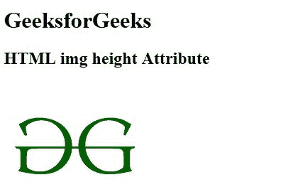

# HTML | 身高属性

> 原文:[https://www.geeksforgeeks.org/html-img-height-attribute/](https://www.geeksforgeeks.org/html-img-height-attribute/)

**< img >高度属性**用于以像素为单位指定图像的高度。

**语法:**

```html

```

**属性值:**包含单值像素，以像素为单位指定图像的高度。

**示例:**

```html
<!DOCTYPE html>
<html>

<head>
    <title>
        HTML img height Attribute
    </title>
</head>

<body>
    <h1>GeeksforGeeks</h1>

    <h2>HTML img height Attribute</h2>

    
</body>

</html>
```

**输出:**


**支持的浏览器:**以下是 **HTML < img >身高属性**支持的浏览器:

*   谷歌 Chrome
*   微软公司出品的 web 浏览器
*   火狐浏览器
*   旅行队
*   歌剧