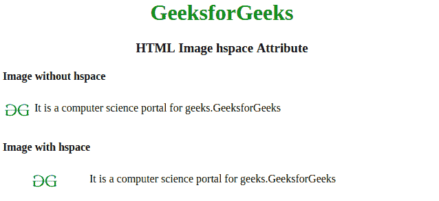

# HTML |  hspace 属性

> 原文:[https://www.geeksforgeeks.org/html-img-hspace-attribute/](https://www.geeksforgeeks.org/html-img-hspace-attribute/)

**HTMLhs space 属性**用于指定图像左右两侧的空格数。HTML 5 不支持 hspace 属性，你可以在那里使用 CSS。

**语法:**

```html
 
```

**属性值:**

*   **像素:**以像素为单位指定空格数。

**示例:**

```html
<!DOCTYPE html>
<html>

<head>
    <title>
        HTML  hspace Attribute
    </title>

    <style>

        h1,
        h3 {
            text-align: center;
        }

        h4 {
            font-weight: bold;
        }
    </style>
</head>

<body>

    <h1 style="color:green;"> 
            GeeksforGeeks 
        </h1>

    <h3>HTML Image hspace Attribute</h3>
    <h4>Image without hspace</h4>
    <p>
      It is a computer science portal for geeks.GeeksforGeeks
    </p>
    <h4>Image with hspace</h4>
    <p>
      It is a computer science portal for geeks.GeeksforGeeks
    </p>

</body>

</html>
```

**输出:**


**支持的浏览器:**以下列出了 *HTML < img > hspace 属性*支持的浏览器:

*   谷歌 Chrome
*   微软公司出品的 web 浏览器
*   火狐浏览器
*   歌剧
*   旅行队