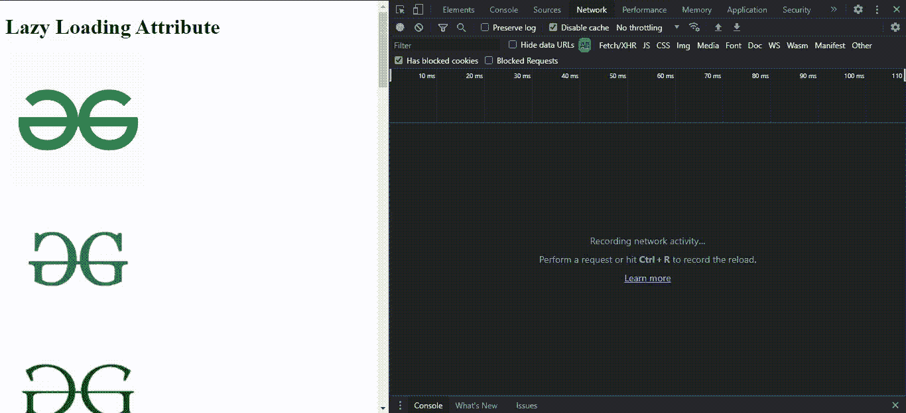
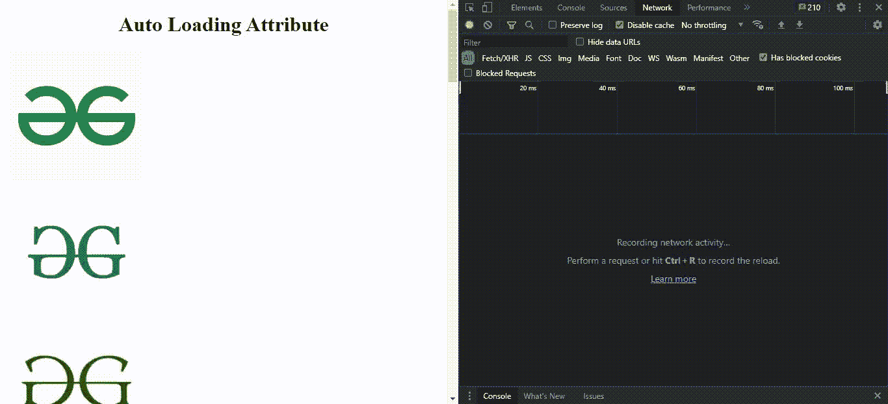

# HTML 加载属性

> 原文:[https://www.geeksforgeeks.org/html-img-loading-attribute/](https://www.geeksforgeeks.org/html-img-loading-attribute/)

在本文中，我们将讨论 HTML img 加载属性。此属性处理图像如何加载到网页上。它接受三个字符串值，即自动、渴望和懒惰。

**延迟加载属性:**该策略用于将资源识别为非关键资源，并且只有在需要时才会加载资源。换句话说，只要网页内容不是必需的，惰性加载就会推迟网页内容的加载。这项技术有助于优化页面&允许他们以后加载。通常，网页上的图像尺寸很大。为此，延迟加载对于延迟屏幕外的图像非常有用。请参考[什么是懒装？](https://www.geeksforgeeks.org/what-is-lazy-loading/)条。

**语法:**

```html

```

**属性值:**

*   **auto:** 是浏览器默认的懒加载行为，浏览器会针对内容的懒加载进行判定。
*   **急切:**图像对应的它将加载没有任何延迟 ie。，它将立即加载资源，而不管它在页面上的位置。
*   **lazy:** 它延迟加载与之对应的图像，直到浏览器指定它预计很快出现。它可以帮助优化网页的加载时间，方法是将图像的加载推迟到预期出现的时候，而不是立即加载。

我们将通过示例使用这些属性值来查看每种情况下的变化。

**示例 1:** 这个示例说明了惰性属性的使用。

## 超文本标记语言

```html
<!DOCTYPE html>
<head>
  <meta charset="utf-8" />
  <title>Lazy Loading Images Attribute</title>
  <style>
    img {
      height: 200px;
      width: 200px;
      display: block;
      margin: 10px;
    }
  </style>
</head>

<body>
  <h1>Lazy Loading Attribute</h1>
  

  

  

  

  

  

  

  

  

  

  

  

  

  

  
</body>
</html>
```

**输出:**



**示例 2:** 该示例说明了自动&急装属性的使用。

## 超文本标记语言

```html
<!DOCTYPE html>
<head>
  <meta charset="utf-8" />
  <title>Image Loading Attribute</title>
  <style>
    img {
      height: 200px;
      width: 200px;
      display: block;
      margin: 10px;
    }
    h1 {
      text-align: center;
    }
  </style>
</head>
<body>
  <h1>Auto Loading Attribute</h1>
  

  

  

  

  

  

  
  <h1>Eager Loading Attribute</h1>

  

  

  

  

  

  

  

  
</body>
</html>
```

**输出:**



**注意:**在 chrome 这样的浏览器中，图像加载是即时的，所以你可能分辨不出来。但是装载时间得到了优化。

**支持的浏览器:**

*   Chrome 77.0 及以上版本
*   Edge 79.0 及以上
*   Firefox 92.0 及以上版本