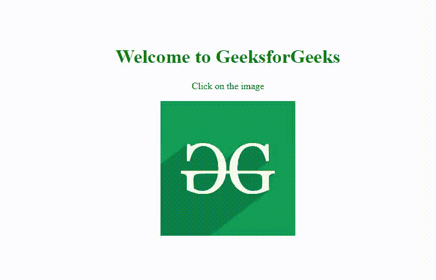

# HTML  longdesc 属性

> 原文:[https://www.geeksforgeeks.org/html-img-longdesc-attribute/](https://www.geeksforgeeks.org/html-img-longdesc-attribute/)

在本文中，我们将讨论 HTML 中的 **longdesc** 。 **Longdesc** 是一个 HTML 属性，用于提供图像的详细描述。这是一个可选属性，可用于添加除了作为工具提示提供的较短描述之外的有关图像的额外细节。

**语法:**

```html

```

**属性值:**

*   **longdesc:** 该值可以是包含详细描述的指定文档的网址。

**注意:****longdesc 属性**仅适用于旧版本的 HTML(即 HTML 4.0 或更旧版本)。使用最新版本的 HTML 的浏览器不再支持它。

**示例:**在本例中，我们将包括*GFG.html，它是一个包含图像附加细节的普通 Html 文件。*

## index.html

```html
<!DOCTYPE html>
<html>

<head>
    <meta charset="utf-8" />
    <title>HTML img longdesc Attribute</title>
    <style>
        .container {
            position: fixed;
            top: 20%;
            left: 44%;
            margin-top: -65px;
            margin-left: -100px;
            text-align: center;
        }

        h1 {
            text-align: center;
            color: #24650b;
        }
    </style>
</head>

<body>
    <div class="container">
        <h1>Welcome to GeeksforGeeks</h1>
        <p>Click on the image</p>

        
    </div>
</body>

</html>
```

## GFG.html 格式

```html
<!DOCTYPE html>
<html>

<head>
    <meta charset="utf-8" />
    <style>
        p {
            text-align: justify;
            text-justify: inter-word;
        }

        .container {
            box-sizing: content-box;
            width: 600px;
            height: 214px;
            padding: 20px;
            font-size: 18px;
            position: fixed;
            top: 20%;
            left: 33%;
            margin-top: -65px;
            margin-left: -100px;
            border-radius: 2px;
        }

        h1 {
            text-align: center;
            color: #24650b;
        }
    </style>
</head>

<body>
    <div class="container">
        <p>
            What We Offer We provide a variety of
            services for you to learn, thrive and 
            also have fun! Free Tutorials, Millions 
            of Articles, Live, Online and Classroom 
            Courses ,Frequent Coding Competitions, 
            Webinars by Industry Experts, Internship 
            opportunities and Job Opportunities. 
            With the idea of imparting programming 
            knowledge, Mr. Sandeep Jain, an IIT 
            Roorkee alumnus started a dream, 
            GeeksforGeeks. Whether programming
            excites you or you feel stifled, 
            wondering how to prepare for interview
            questions or how to ace data structures 
            and algorithms, GeeksforGeeks is a 
            one-stop solution. Our vision is to 
            build a gigantic network of geeks
            and we are only a fraction of it yet.
        </p>
    </div>
</body>

</html>
```

**输出:**


**示例:**但是，以上示例中使用的功能不再推荐&任何浏览器都不支持。相反，我们可以将链接(< a >标签)添加到将显示图像描述的图像中。为此，我们将把*GFG.html*文件纳入我们的*index.html*文件。

## index.html

```html
<!DOCTYPE html>
<html>

<head>
    <meta charset="utf-8" />
    <title>HTML img longdesc Attribute</title>
    <style>
        .container {
            position: fixed;
            top: 20%;
            left: 44%;
            margin-top: -65px;
            margin-left: -100px;
            text-align: center;
        }

        h1 {
            text-align: center;
            color: #24650b;
        }
    </style>
</head>

<body>
    <div class="container">
        <h1>Welcome to GeeksforGeeks</h1>
        <p>Click on the image</p>

        <a href="GFG.html">
            
        </a>
    </div>
</body>

</html>
```

## GFG.html 格式

```html
<!DOCTYPE html>
<html>

<head>
    <meta charset="utf-8" />
    <style>
        p {
            text-align: justify;
            text-justify: inter-word;
        }

        .container {
            box-sizing: content-box;
            width: 600px;
            height: 214px;
            padding: 20px;
            border: 1px solid black;
            font-size: 18px;

            position: fixed;
            top: 20%;
            left: 33%;
            margin-top: -65px;
            margin-left: -100px;
            border-radius: 2px;
        }

        h1 {
            text-align: center;
            color: #24650b;
        }
    </style>
</head>

<body>
    <h1>GeeksforGeeks</h1>
    <div class="container">
        <p>
            A Computer Science portal for geeks. 
            It contains well written, well 
            thought and well explained computer 
            science and programming articles.
            Free Tutorials, Millions of Articles, 
            Live, Online and Classroom Courses, 
            Frequent Coding Competitions, Webinars 
            by Industry Experts. With the idea 
            of imparting programming knowledge, 
            Mr. Sandeep Jain, an IIT Roorkee 
            alumnus started a dream, GeeksforGeeks.
            Whether programming excites you or you
            feel stifled, wondering how to prepare 
            for interview questions or how to ace 
            data structures and algorithms, 
            GeeksforGeeks is a one-stop solution. 
            Our vision is to build a gigantic 
            network of geeks and we are only a 
            fraction of it yet.
        </p>
    </div>
</body>

</html>
```

**输出:**



**支持的浏览器:**现在任何浏览器都不支持该属性。