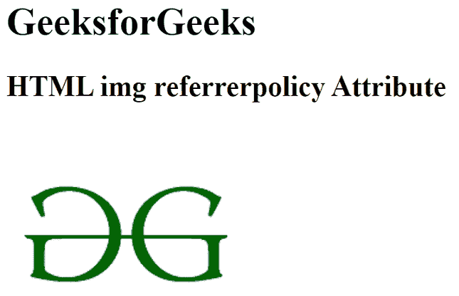

# HTML 引用者策略属性

> 原文:[https://www . geesforgeks . org/html-img-referer policy-attribute/](https://www.geeksforgeeks.org/html-img-referrerpolicy-attribute/)

**HTMLreferrer policy**属性用于指定获取图像时将发送到服务器的参考信息。

**语法:**

```html
  
```

**属性值:**

*   **无引用者:**指定不会随请求发送引用信息。
*   **降级时无推荐人:**有默认值。它指定引用头将不会发送到没有 HTTPS 的源。
*   **来源:**指定在所有情况下发送文档的来源作为推荐人。
*   **原点-当-跨原点:**执行同原点请求时发送原点、路径、查询字符串，其他情况只发送单据的原点。
*   **不安全-url:** 发送原点。路径和查询字符串，但不包括片段、密码和用户名。

**示例:**下面的代码说明了< img >引用者策略属性的使用。

## 超文本标记语言

```html
<!DOCTYPE html>
<html>

<body>
    <h1>GeeksforGeeks</h1>

    <h2>
        HTML img referrerpolicy Attribute
    </h2>
    
</body>

</html>
```

**输出:**



**支持的浏览器:**

*   谷歌 Chrome
*   微软公司出品的 web 浏览器
*   火狐浏览器
*   旅行队
*   歌剧