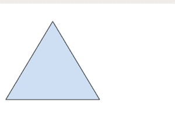

# HTML | 使用地图属性

> 原文:[https://www.geeksforgeeks.org/html-img-usemap-attribute/](https://www.geeksforgeeks.org/html-img-usemap-attribute/)

 usemap 属性用于将图像指定为客户端图像映射。图像地图是可点击的图像区域。usemap 属性用于创建图像和地图之间的关系。
**语法:**

```html

```

**属性值:**

*   **映射名:**用于保存包含哈希(#)字符的映射名。

**例:**

## 超文本标记语言

```html
<!DOCTYPE html>
<html>

<head>
    <title>HTML img usemap Attribute</title>

    <style>
        body {
            text-align: center;
        }

        h1 {
            color: green;
        }
    </style>
</head>

<body>
    <h1>GeeksforGeeks</h1>

    <h2>HTML  usemap Attribute</h2>

    

    <map name="shapemap">

        <!-- area tag contained image. -->
        <area shape="poly" coords="59, 31, 28, 83, 91, 83" href=
"https://media.geeksforgeeks.org/wp-content/uploads/20190227165802/area2.png"
            alt="Triangle">

        <area shape="circle" coords="155, 56, 26" href=
"https://media.geeksforgeeks.org/wp-content/uploads/20190227165934/area3.png"
            alt="Circle">

        <area shape="rect" coords="224, 30, 276, 82" href=
"https://media.geeksforgeeks.org/wp-content/uploads/20190227170021/area4.png"
            alt="Square">
    </map>
</body>

</html>
```

**输出:**

**点击具体可点击区域前:**


**点击特定可点击区域后:**



**支持的浏览器:**HTMLusemap 属性支持的浏览器如下:

*   谷歌 Chrome
*   微软公司出品的 web 浏览器
*   火狐浏览器
*   旅行队
*   歌剧