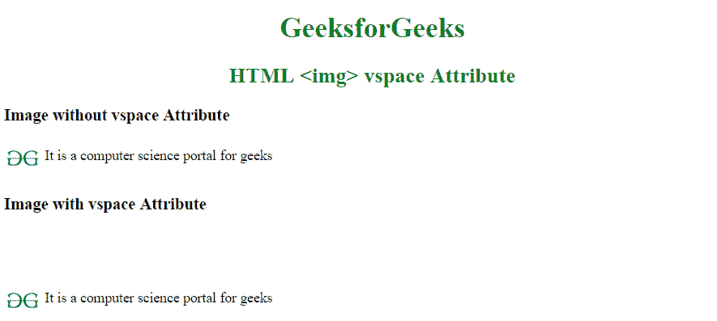

# HTML |  vspace 属性

> 原文:[https://www.geeksforgeeks.org/html-img-vspace-attribute/](https://www.geeksforgeeks.org/html-img-vspace-attribute/)

**HTML < img > vspace 属性**用于指定图像底部和顶部的空白数量。

**语法:**

```html

```

**属性值:**

*   **像素:**它以像素为单位指定图像顶部和底部的空白数量。

**示例:**

```html
<!DOCTYPE html> 
<html> 

<head> 
    <title> 
        HTML img vspace Attribute 
    </title> 

    <style>
        h1, h2 {
            color:green;
            text-align:center;
        }
        h3 {
            font-weight:bold;
        }
    </style>
</head> 

<body> 

    <h1 style="color:green;"> 
        GeeksforGeeks 
    </h1> 

    <h2>HTML  vspace Attribute</h2>

    <h3>Image without vspace Attribute</h3>

    <p>
        
        It is a computer science portal for geeks
    </p>

    <h3>Image with vspace Attribute</h3>

    <p>
        
        It is a computer science portal for geeks
    </p>
</body> 

</html>                    
```

**输出:**


**支持的浏览器:**以下是*HTMLvs space 属性*支持的浏览器:

*   谷歌 Chrome
*   微软公司出品的 web 浏览器
*   火狐浏览器
*   旅行队
*   歌剧