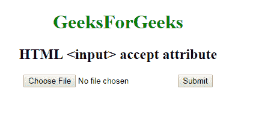

# HTML | <input>接受属性

> 原文:[https://www.geeksforgeeks.org/html-input-accept-attribute/](https://www.geeksforgeeks.org/html-input-accept-attribute/)

**HTML <输入>接受属性**用于*指定服务器接受的文件类型*。该属性只能与 **<输入类型=【文件】>** 元素一起使用。此属性不用于验证工具，因为文件上载应该在服务器上进行验证。
**语法:**

```html
<input accept = "file_extension | audio/* | video/* | image/* | media_type">
```

**属性值**

*   **文件扩展名:**指定文件扩展名。gif，。jpg，。巴布亚新几内亚。doc)用户可以从中进行选择。
*   **音频/*:** 用户可以拾取所有声音文件。
*   **视频/*:** 用户可以拾取所有视频文件。
*   **图像/*:** :有效媒体类型，无参数。查看 IANA 媒体类型，了解标准媒体类型的完整列表
*   **媒体类型:**没有参数的有效媒体类型。

**示例:**

## 超文本标记语言

```html
<!DOCTYPE html>
<html>

<head>
    <title>
      HTML input accept attribute
  </title>
    <style>
        body {
            text-align: center;
        }

        h1 {
            color: green;
        }
    </style>
</head>

<body>
    <h1>GeeksForGeeks</h1>
    <h2>
      HTML <input> accept attribute
  </h2>
    <form action=" ">
        <input type="file"
               name="picture"
               accept="image/*">

        <input type="submit">
    </form>
</body>

</html>
```

**输出:**



**支持的浏览器:**支持的浏览器 **HTML <输入>接受属性**如下:

*   谷歌 Chrome 8.0
*   Internet Explorer 10.0
*   Firefox 4.0
*   苹果 Safari 6.0
*   Opera 15.0