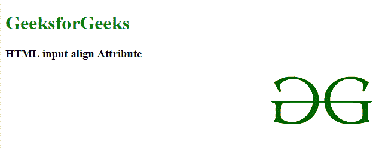
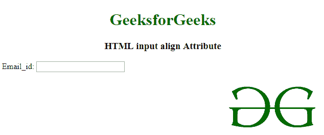

# HTML | <input>对齐属性

> 原文:[https://www.geeksforgeeks.org/html-input-align-attribute/](https://www.geeksforgeeks.org/html-input-align-attribute/)

**HTML <输入>对齐属性**与 **<输入 type="image" >** 一起设置图像的水平对齐。HTML 5 不支持。

**语法:**

```html
<input align="left|right|middle|top|bottom">
```

**属性值:**

*   **左:**设置图像向左对齐。
*   **右:**设置图像向右对齐。
*   **中间:**设置图像向中间对齐。
*   **顶部:**设置图像与顶部对齐。
*   **底部:**设置图像向底部对齐。

**例 1:**

```html
<!DOCTYPE html>
<html>

<head>
    <title>
        HTML input align Attribute
    </title>
</head>

<body>
    <h1 style="color:green;">GeeksforGeeks</h1>

    <h3>HTML input align Attribute</h3> 

    <input type="image" src= 
"https://media.geeksforgeeks.org/wp-content/uploads/20190506164011/logo3.png"
        alt="GeeksforGeeks logo" align="right"> 
</body> 

</html>
```

**输出:**


**例 2:**

```html
<!DOCTYPE html>
<html>

<head>
    <title>
        HTML input align Attribute
    </title>
</head>

<body>
    <center>
        <h1 style="color:green;">GeeksforGeeks</h1>

        <h3>HTML input align Attribute</h3>
    </center>
    <div>
        Email_id:
        <!--Here type="text" align will not work-->
        <input type="text" alt="mail_id" align="right">
        <input type="image" src=
"https://media.geeksforgeeks.org/wp-content/uploads/20190506164011/logo3.png" 
                     alt="GeeksforGeeks" align="right">
    </div>
</body>

</html>
```

**输出:**

**注意:**由于 **<输入 type="image" >** 不受 HTML5 的支持，所以可以用那里的 CSS 代替这个属性。CSS **<的语法输入类型=“image”style =“float:right”>**。
**支持的浏览器:**

*   谷歌 Chrome
*   微软公司出品的 web 浏览器
*   火狐浏览器
*   旅行队
*   歌剧