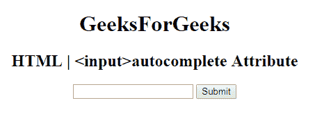

# HTML |自动完成属性

> 原文:[https://www . geesforgeks . org/html-input-autocomplete-attribute/](https://www.geeksforgeeks.org/html-input-autocomplete-attribute/)

**HTML | <输入>自动完成属性**用于指定输入字段已经自动完成的*是打开还是关闭*。当浏览器上的自动完成属性设置为时，将根据用户之前输入的值自动完成。它可以处理许多输入字段，如文本、搜索、网址、电子邮件、密码、日期选择器、范围和颜色。
**语法:**

```html
<input autocomplete="on|off">
```

**属性值:**

*   **开:**有默认值。它指定启用自动完成。
*   **关闭:**指定自动完成被禁用。

**示例:**本示例说明了自动完成属性在 **<输入>** 元素中的使用。

## 超文本标记语言

```html
<!DOCTYPE html>
<html>

<head>
    <title>
        HTML |
    <input>autocomplete Attribute
    </title>
</head>

<body style="text-align:center;">

    <h1>GeeksForGeeks</h1>

    <h2>
    HTML |
    <input>autocomplete Attribute
</h2>
    <form id="myGeeks">
        <input type="text"
            id="text_id"
            name="geeks"
            autocomplete="on">

        <input type="submit">

    </form>

    <br>
</body>

</html>
```

**输出:**



**支持的浏览器:**支持 **HTML | <输入>自动完成属性**的浏览器如下:

*   谷歌 Chrome
*   微软公司出品的 web 浏览器
*   火狐浏览器
*   歌剧
*   旅行队