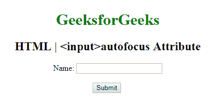

# HTML | <input>自动对焦属性

> 原文:[https://www . geesforgeks . org/html-输入-自动对焦-属性/](https://www.geeksforgeeks.org/html-input-autofocus-attribute/)

**HTML <输入>自动对焦属性**用于指定*输入栏在页面加载*时必须自动对焦。它是一个布尔属性。

**语法:**

```html
<input autofocus> 
```

**示例:**该示例说明了在<输入>元素时自动对焦属性的使用。

```html
<!DOCTYPE html>
<html>

<head>
    <title>
        HTML | 
      <input>autofocus Attribute
    </title>
</head>

<body style="text-align:center">

    <h1 style="color: green;"> 
        GeeksforGeeks 
    </h1>

    <h2> 
        HTML | 
      <input>autofocus  Attribute 
    </h2> Name:
    <input type="text" autofocus>
    <br>
    <br>
    <!-- Assign id to the Button. -->
    <button id="GFG">
        Submit
    </button>

    <br>
</body>

</html>
```

**输出:**


**支持的浏览器:**以下是 **HTML | <输入>自动对焦属性**支持的浏览器:

*   谷歌 Chrome
*   微软公司出品的 web 浏览器
*   火狐浏览器
*   歌剧
*   旅行队