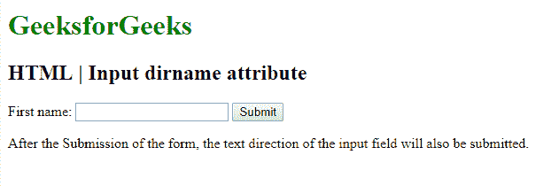

# HTML | <input> dirname 属性

> 原文:[https://www.geeksforgeeks.org/html-input-dirname-attribute/](https://www.geeksforgeeks.org/html-input-dirname-attribute/)

**HTML 输入目录属性**用于提交表单后启用输入的文本方向和文本区域字段。dirname 属性的值必须是输入字段和文本区域的名称，后跟**。目录“**”。

它可以与 **<输入>** 和 **<文本区>** 元素一起使用。

**语法:**

```html
<input name="myname" dirname="myname.dir">
```

**属性值:**

*   **name.dir** 指定提交输入字段的文本方向。

以下示例说明了输入元素中目录名属性的使用。

**示例:**

```html
<!DOCTYPE html>
<html>

<head>
    <title>
    </title>
    <style>
        h1 {
            color: green;
        }
    </style>
</head>

<body>

    <form>
        <h1> 
        GeeksforGeeks 
    </h1>
        <h2> 
        HTML | Input dirname attribute 
    </h2> First name:
        <input type="text" 
               name="fname" 
               dirname="fname.dir">

        <input type="submit" 
               value="Submit">
    </form>

    <p>
        After the Submission of the form,
      the text direction of the input field
      will also be submitted.
    </p>

</body>

</html>
```

**输出:**


**支持的浏览器:****HTML 输入目录属性**支持的浏览器如下:

*   谷歌 Chrome
*   微软公司出品的 web 浏览器
*   苹果 Safari
*   歌剧