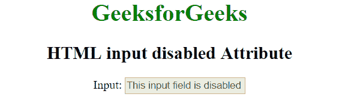

# HTML <input>禁用属性

> 原文:[https://www . geesforgeks . org/html-输入-禁用-属性/](https://www.geeksforgeeks.org/html-input-disabled-attribute/)

HTML 中<输入>元素的**禁用**属性用于指定输入字段被禁用。禁用的输入不可点击且不可用。它是一个布尔属性。禁用的<输入>元素不在表单中提交。

**语法:**

```html
<input disabled>

```

**示例:**

```html
<!DOCTYPE html> 
<html> 
    <head> 
        <title>HTML input disabled Attribute</title> 
    </head> 

    <body style = "text-align:center">    
        <h1 style = "color: green;">GeeksforGeeks</h1>
        <h2>HTML input disabled Attribute</h2>

        <label>Input:

            <!--A disabled input-->
            <input type="text" name="value" value = "This input field 
                   is disabled" disabled>
        </label>
    </body> 
</html>    
```

**输出:**


**支持的浏览器:**输入>禁用属性支持的浏览器如下:

*   苹果 Safari 1.0
*   谷歌 Chrome 1.0
*   Firefox 1.0
*   Opera 1.0
*   Internet Explorer 6.0