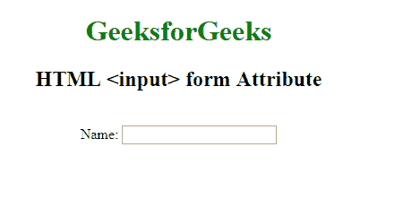

# HTML <input>表单属性

> 原文:[https://www.geeksforgeeks.org/html-input-form-attribute/](https://www.geeksforgeeks.org/html-input-form-attribute/)

**HTML <输入>表单属性**用于指定 **<输入>** 元素可以包含一个或多个表单。

**语法:**

```html
<input form="form_id">
```

**属性值:**包含单个值 **form_id** ，该值包含指定按钮元素所属的一个或多个的 *form_id* 。该属性的值应该是 **<表单>** 元素的 id。

**示例:**本示例说明了在 **<中输入>** 元素的形态属性的 us。

```html
<!DOCTYPE html>
<html>

<head>
    <title>
        HTML input form Attribute
    </title>
</head>

<body style="text-align:center">

    <h1 style="color:green;"> 
        GeeksforGeeks 
    </h1>

    <h2> 
        HTML <input> form Attribute 
    </h2>

    <form id="myGeeks"></form>
    <br> Name:
    <input type="text"
           id="btn" 
           name="myGeeks" 
           form="myGeeks">

</body>

</html>
```

**输出:**


**支持的浏览器:**支持的浏览器 **HTML <输入>表单属性**如下:

*   谷歌 Chrome 9.0
*   Firefox 4.0
*   苹果 Safari 5.1
*   歌剧 10.6