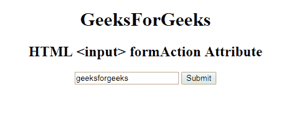

# HTML | <input>表单属性

> 原文:[https://www . geesforgeks . org/html-input-formaction-attribute/](https://www.geeksforgeeks.org/html-input-formaction-attribute/)

**HTML <输入>表单属性**用于*指定将表单*的数据发送到哪里。提交表单后，formaction 属性被调用。表单数据将在表单提交后发送到服务器。它覆盖了 [<表单>](https://www.geeksforgeeks.org/html-form-tag/) 元素的动作属性特征。

**语法:**

```html
<input formaction="URL"> 
```

**属性值:**包含单值 URL，用于指定表单提交后要发送数据的文档的 URL。
网址的可能值有:

*   **绝对 URL:** 它指向一个页面的完整地址。例如:*www.geeksforgeeks.org/data-structure*
*   **相对网址:**用于指向网页中的文件。例如:*gfg.php*

**示例:**

```html
<!DOCTYPE html>
<html>

<head>
    <title>
        HTML <input> formAction Attribute
    </title>
</head>

<body style="text-align:center;">
    <h1> 
        GeeksForGeeks 
    </h1>

    <h2> 
        HTML  <input> formAction Attribute 
    </h2>

    <form action="#"
          method="get"
          target="_self">

        <input type="text" 
               id="Geeks"
               name="myGeeks" 
               value="geeksforgeeks" 
               formTarget="_blank" 
               formMethod="post" 
               formAction="test.php">
        <input type="submit">
    </form>
</body>

</html>
```

**输出:**


**支持的浏览器:**输入>形式属性的 **HTML | <支持的浏览器如下:**

*   谷歌 Chrome
*   微软公司出品的 web 浏览器
*   火狐浏览器
*   苹果 Safari
*   歌剧