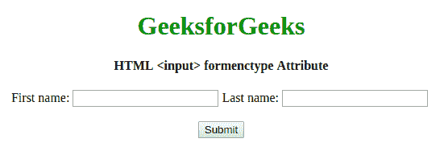

# HTML | <input>表单类型属性

> 原文:[https://www . geesforgeks . org/html-input-formenctype-attribute/](https://www.geeksforgeeks.org/html-input-formenctype-attribute/)

**HTML <输入>表单类型属性**用于指定向服务器提交表单时如何对表单数据进行编码。此属性适用于**方法=“发布”**。该属性覆盖 **<表单>** 元素的 enctype 属性。

**语法:**

```html
<input formenctype="value">
```

**属性值:**

*   **application/x-www-form-URL encoded:**为默认值。它在发送到服务器之前对所有字符进行编码。它将所有空格转换为**“+”**符号，将特殊字符转换为其**“十六进制”**值。
*   **多部分/表单数据:**该值不编码任何字符。
*   **文本/普通:**该值将空格转换为**“+”**符号，但不转换特殊字符。

**示例:**

```html
<!DOCTYPE html>
<html>

<head>
    <title>HTML input formenctype Attribute</title>
</head>

<body style="text-align: center">

    <h1 style="color: green">GeeksforGeeks</h1>

    <h4>HTML <input> formenctype Attribute</h4>

    <form action="#" method="post">

        First name:
        <input type="text" name="fname"> Last name:
        <input type="text" name="lname">
        <br>
        <br>

        <input type="submit" value="Submit" 
               formenctype="multipart/form-data">
    </form>
</body>

</html>
```

**输出:**


**支持的浏览器:***HTML 输入表单类型属性*支持的浏览器如下:

*   谷歌 Chrome 9.0
*   Internet Explorer 10.0
*   Firefox 4.0
*   歌剧 10.6
*   Safari 5.1