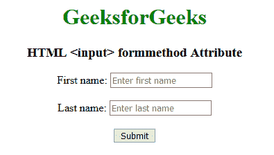

# HTML |输入法表单属性

> 原文:[https://www . geesforgeks . org/html-input-form method-attribute/](https://www.geeksforgeeks.org/html-input-formmethod-attribute/)

**HTML <输入> formmethod** 属性用于指定将表单数据发送到动作 URL 的 HTTP 方法。该属性用于覆盖<表单>元素的方法属性。

**语法:**

```html
<input formmethod="get | post">
```

**属性值:**

*   **get:** 在 get 方法中，表单提交后，表单值会在新浏览器选项卡的地址栏中可见。它的大小限制在 3000 个字符左右。它仅适用于非安全数据，不适用于敏感信息。
*   **post:** 在 post 方法中，表单提交后，表单值在新浏览器选项卡的地址栏中将不会像在 GET 方法中一样可见。它将表单数据追加到 HTTP 请求的正文中。它没有大小限制。此方法不支持对结果添加书签。

**示例:**

```html
<!DOCTYPE html>
<html>

<head>
    <title>
        HTML input formmethod Attribute
    </title>
</head>

<body style="text-align:center;">

    <h1 style="color:green;">
      GeeksforGeeks
  </h1>

    <h3>HTML <input> 
      formmethod Attribute</h3>

    <form action="#" 
          id="users"
          action="#" 
          method="GET"
          target="_blank">

        First name:
        <input type="text"
               name="fname" 
               placeholder="Enter first name">

        <br>
        <br> Last name:
        <input type="text"
               name="lname"
               placeholder="Enter last name">
        <br>
        <br>

        <input type="submit" 
               value="Submit" 
               formmethod="post">

    </form>
</body>

</html>
```

**输出:**


**支持的浏览器:****HTML 输入法属性**支持的浏览器如下:

*   谷歌 Chrome 9.0
*   Internet Explorer 10.0
*   Firefox 4.0
*   Safari 5.1
*   歌剧 10.6