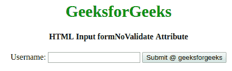

# HTML | <input>表单模板属性

> 原文:[https://www . geeksforgeeks . org/html-input-formnovalidate-attribute/](https://www.geeksforgeeks.org/html-input-formnovalidate-attribute/)

**HTML <输入>表单更新属性**用于指定提交表单时不验证输入元素。它是一个布尔属性，该属性可用于覆盖 **<表单>** 元素的**新数据**属性，并且只能与 **<输入类型=“提交”>一起使用。**

**语法:**

```html
<input formnovalidate="formnovalidate">
```

**示例:**本示例说明使用 **<输入> formnovalidate 属性**。

```html
<!DOCTYPE html>
<html>

<head>
    <title>
        HTML Input formNoValidate Attribute
    </title>
    <style>
        h1 {
            color: green;
        }
    </style>
</head>

<body style="text-align:center;">
    <h1> 
     GeeksforGeeks 
    </h1>

    <h4> 
     HTML Input formNoValidate Attribute 
    </h4>

    <form action="#" method="get" target="_self">
        Username:
        <input type="email" name="userid">
        <input type="submit" id="Geeks" name="myGeeks"
               value="Submit @ geeksforgeeks" formTarget="_blank" 
               formnovalidate>

    </form>

</body>

</html>
```

**输出:**


**支持的浏览器:**支持的浏览器 *HTML <输入> formnovalidate 属性*如下:

*   谷歌 Chrome 10.0
*   Internet Explorer 10.0
*   Firefox 4.0
*   歌剧 10.6
*   Safari 10.1