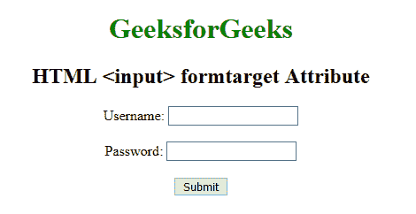

# HTML | <input>表单目标属性

> 原文:[https://www . geesforgeks . org/html-input-formtarget-attribute/](https://www.geeksforgeeks.org/html-input-formtarget-attribute/)

HTML <input> formtarget 属性用于指定提交表单后显示响应的名称或关键字。该属性覆盖

<form>元素的目标属性。</form>

**语法:**

```html
<input formtarget="_blank|_self|_parent|_top|framename">
```

**属性值:**

*   **_blank:** 输入响应显示在新窗口中。
*   **_self:** 输入响应显示在同一帧。
*   **_parent:** 输入响应显示在父框架集中。
*   **_top:** 输入响应显示在窗口的整个主体中。
*   **框架名称:**输入响应显示在命名框架中。

**示例:**

```html
<!DOCTYPE html> 
<html>

<head>
    <title>
        HTML input formtarget Attribute
    </title>
</head>

<body> 
    <center> 
        <h1 style="color:green;"> 
            GeeksforGeeks 
        </h1> 

        <h2> 
            HTML <input> formtarget Attribute
        </h2> 

        <form action="#"> 
            Username: 
            <input type="text" name="usrname"> 

            <br><br>

            Password: 
            <input type="text" name="password"> 

            <br><br> 

            <input type="submit" value="Submit" formtarget="_blank"> 
        </form> 
    </center> 
</body> 

</html> 
```

**输出:**


**支持的浏览器:**HTML<输入> formtarget 属性支持的浏览器如下:

*   谷歌 Chrome 9.0
*   Internet Explorer 10.0
*   Firefox 4.0
*   Safari 5.1
*   歌剧 10.6