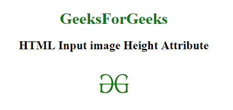

# HTML | <input>身高属性

> 原文:[https://www.geeksforgeeks.org/html-input-height-attribute/](https://www.geeksforgeeks.org/html-input-height-attribute/)

**HTML <输入>高度属性**用于*指定元素*的高度。该属性仅用于输入*类型=“图像”*。

**语法:**

```html
<input height="pixels"> 
```

**属性值:**它包含指定输入元素高度的值，即像素。

**示例:**

```html
<!DOCTYPE html>
<html>

<head>
    <title>
        HTML Input Image height Attribute
    </title>
</head>

<body style="text-align:center;">

    <h1 style="color:green;"> 
            GeeksForGeeks 
        </h1>

    <h2>HTML Input image Height  Attribute</h2>
    <input id="myImage" 
           type="image" 
           src=
"https://media.geeksforgeeks.org/wp-content/uploads/gfg-40.png"
           alt="Submit"
           width="70" 
           height="96" />

</body>

</html>
```

**输出:**


**支持的浏览器:**以下是 **HTML <输入>高度属性**支持的浏览器:

*   谷歌 Chrome
*   Internet Explorer 10.0 +
*   火狐浏览器
*   歌剧
*   旅行队