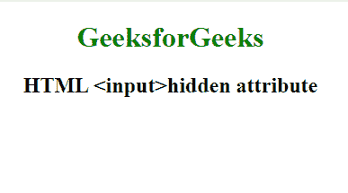

# HTML | <input>隐藏属性

> 原文:[https://www.geeksforgeeks.org/html-input-hidden-attribute/](https://www.geeksforgeeks.org/html-input-hidden-attribute/)

**HTML 输入隐藏属性**用于定义输入字段元素的可见性。它包含一个布尔值。如果使用此属性，浏览器将不会显示指定了隐藏属性的元素。隐藏的属性可以使用一些条件或用于查看隐藏内容的 JavaScript 来查看。

**语法:**

```html
<input hidden>
```

**示例:**

```html
<!DOCTYPE html>
<html>

<head>
    <title>input hidden attribute</title>
    <style>
        body {
            text-align: center;
        }

        h1 {
            color: green;
        }
    </style>
</head>

<body>
    <h1>GeeksforGeeks</h1>
    <h2>HTML <input>hidden attribute</h2>

    <!-- hidden attribute -->
    <input type="text" hidden>

</body>

</html>
```

**输出:**


**支持的浏览器:**输入>隐藏属性的 **<支持的浏览器如下:**

*   谷歌 Chrome
*   微软公司出品的 web 浏览器
*   火狐浏览器
*   苹果 Safari
*   歌剧