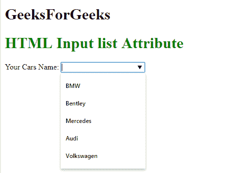

# HTML | <input>列表属性

> 原文:[https://www.geeksforgeeks.org/html-input-list-attribute/](https://www.geeksforgeeks.org/html-input-list-attribute/)

**HTML <输入>列表属性**用于*识别元素的预定义选项列表，以向用户建议*。

**语法:**

```html
<input list="datalist_id">
```

**属性值:**

*   **datalist_id:** 用于指定将用于与输入元素建立链接的 datalist 的 id。

**示例:**

```html
<!DOCTYPE html>
<html>

<head>
    <title>
      HTML Input list Attribute
  </title>
</head>

<body>
    <h1>
        GeeksForGeeks
    </h1>
    <h1 style="color:green">
      HTML Input list Attribute
  </h1>

    <form action="">
        <label>Your Cars Name: </label>
        <input list="cars">
        <datalist id="cars">
            <option value="BMW" />
            <option value="Bentley" />
            <option value="Mercedes" />
            <option value="Audi" />
            <option value="Volkswagen" />
        </datalist>
    </form>
</body>

</html>
```

**输出:**


**支持的浏览器:**支持的浏览器 **HTML <输入>列表属性**如下:

*   谷歌 Chrome 20.0
*   Internet Explorer 10.0
*   Firefox 4.0
*   歌剧 9.6