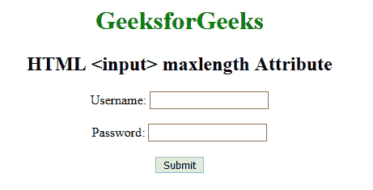

# HTML |输入最大长度属性

> 原文:[https://www . geesforgeks . org/html-input-maxlength-attribute/](https://www.geeksforgeeks.org/html-input-maxlength-attribute/)

**<输入>最大长度属性**用于指定进入<输入>元素的最大字符数。

**语法:**

```html
<input maxlength="number">
```

**属性值:**

*   **数字:**包含允许<输入>元素中最大字符数的单值数字。它的默认值是 524288。

**示例:**

```html
<!DOCTYPE html>
<html>

<head>
    <title>
        HTML input maxlength Attribute
    </title>
</head>

<body>
    <center>
        <h1 style="color:green;"> 
            GeeksforGeeks 
        </h1>

        <h2> 
            HTML <input> maxlength Attribute
        </h2>

        <form action="#">
            Username:
            <input type="text"
                   name="usrname"
                   maxlength="12">

            <br>
            <br> Password:
            <input type="text" 
                   name="password" 
                   maxlength="10">

            <br>
            <br>

            <input type="submit" 
                   value="Submit">
        </form>
    </center>
</body>

</html>
```

**输出:**


**支持的浏览器:****输入最大长度属性**支持的浏览器如下:

*   谷歌 Chrome 1.0
*   Internet Explorer 2.0
*   Firefox 1.0
*   Safari 1.0
*   Opera 1.0