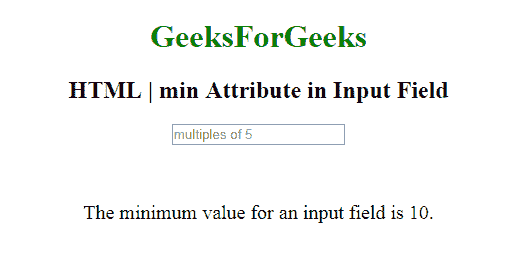

# HTML | <input>最小属性

> 原文:[https://www.geeksforgeeks.org/html-input-min-attribute/](https://www.geeksforgeeks.org/html-input-min-attribute/)

**HTML 最小属性**用于*指定输入字段*的最小值。它可以与 max 属性一起使用来创建一个值范围。
可与数字、范围、日期、日期时间、本地日期时间、月份、时间和星期等多个输入字段一起使用。

**语法:**

```html
<input min="number|date">
```

**属性值:**

*   **数字:**它包含值，即指定输入字段允许的最小值的数字。
*   **日期:**包含指定 **<输入>** 日期字段允许的最小日期的值，即日期。

**示例:**本示例说明了在 **<中使用 min 属性输入>** 元素。

```html
<!DOCTYPE html>
<html>

<body style="text-align:center;">

    <h1 style="color:green;"> 
            GeeksForGeeks 
        </h1>

    <h2>
      HTML | min Attribute in Input Field
  </h2>
    <form id="myGeeks">
        <input type="number" 
               id="myNumber"
               step="5"
               name="geeks" 
               placeholder="multiples of 5"
               min="10">
    </form>
    <br>
    <br>
    <p style="font-size:20px;">
      The minimum value for an input field is 10.
  </p>
</body>

</html>
```

**输出:**


**支持的浏览器:**以下是 *HTML <输入> min 属性*支持的浏览器:

*   谷歌 Chrome
*   微软公司出品的 web 浏览器
*   火狐浏览器
*   歌剧
*   旅行队