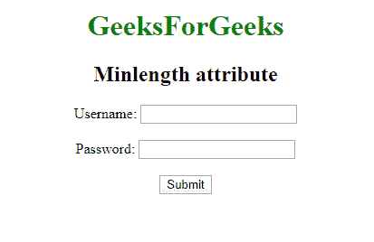

# HTML | <input>分长度属性

> 原文:[https://www . geesforgeks . org/html-input-min length-attribute/](https://www.geeksforgeeks.org/html-input-minlength-attribute/)

**HTML <输入>最小长度属性**用于定义<输入>最小长度属性。整数值必须以 0 或更高的值开始。

**语法:**

```html
< input minlength="numeric"> 
```

**属性值:**

*   **数字:**包含数值，即 0 或更高。

**示例:**

```html
<!DOCTYPE html> 
<html>

<body>
    <center>
        <h1 style="color:green;"> 
        GeeksForGeeks 
        </h1>
        <h2> 
        minlength attribute 
        </h2>
        <form action="">
            Username:
            <input type="text" 
                   name="usrname" 
                   minlength="10">
            <br>
            <br> Password:
            <input type="text" 
                   name="password" 
                   maxlength="10">
            <br>
            <br>
            <input type="submit" 
                   value="Submit">
        </form>
    </center>
</body>

</html>
```

**输出:**


**支持的浏览器:**输入>最小长度属性的 **<支持的浏览器如下:**

*   谷歌 Chrome
*   微软公司出品的 web 浏览器
*   火狐浏览器
*   苹果 Safari
*   歌剧