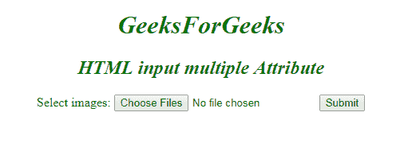

# HTML | <input>多属性

> 原文:[https://www . geesforgeks . org/html-input-multi-attribute/](https://www.geeksforgeeks.org/html-input-multiple-attribute/)

**HTML <输入>多属性**为布尔属性。它指定允许用户选择一个元素中出现的多个值。多个属性用于许多输入字段，如电子邮件、文件等。

**语法:**

```html
<input multiple> 
```

**示例:**

```html
<!DOCTYPE html>
<html>

<body>
    <center>
        <h1 style="color:green;font-style:italic;">
          GeeksForGeeks
      </h1>
        <h2 style="color:green;font-style:italic;">
          HTML input multiple Attribute
      </h2>
        <form action=" ">
            Select images:
            <input type="file" name="img" multiple>
            <input type="submit">
        </form>
  </center>

</body>

</html>
```

**输出:**


**支持的浏览器:**

*   谷歌 Chrome 6.0
*   Firefox 3.6
*   Edge 10.0
*   Opera 11.0
*   苹果 Safari 5.0