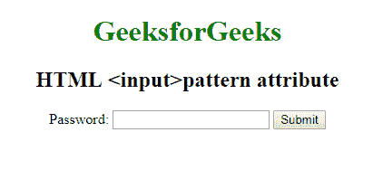

# HTML | <input>模式属性

> 原文:[https://www.geeksforgeeks.org/html-input-pattern-attribute/](https://www.geeksforgeeks.org/html-input-pattern-attribute/)

**HTML <输入>模式属性**用于指定检查输入元素值所依据的正则表达式。该属性适用于以下输入类型:文本、密码、日期、搜索、电子邮件等。使用全局标题属性来描述帮助用户的模式。

**语法:**

```html
<input pattern = "regular_exp">
```

**示例:**本示例说明了在<输入>元素时模式属性的使用。

```html
<!DOCTYPE html> 
<html> 
    <head> 
        <title>
            HTML input pattern attribute
        </title> 

        <style> 
            body { 
                text-align:center; 
            } 
            h1 { 
                color:green; 
            } 
        </style> 
    </head> 

    <body> 
        <h1>GeeksforGeeks</h1> 

        <h2>HTML <input>pattern attribute</h2> 

        <form action="#"> 
            Password: <input type="text" name="Password"

            pattern="[A-Za-z]{3}" title="Three letter Password"> 

            <input type="submit"> 
        </form> 
    </body> 
</html>
```

**输出:**


**支持的浏览器:**HTML<输入>模式属性支持的浏览器如下:

*   谷歌 Chrome 5.0
*   Internet Explorer 10.0
*   Firefox 4.0
*   Safari 10.1
*   歌剧 9.6